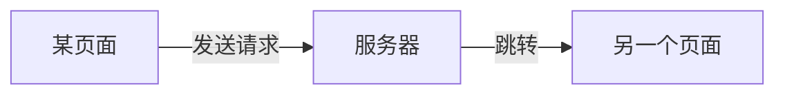
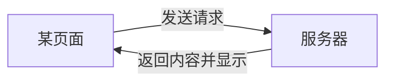

Java Spring MVC 03——使用方法（三）

# Spring MVC 返回 JSON 数据
## 准备工作
### 导入相关依赖
pom.xml
```xml
<?xml version="1.0" encoding="UTF-8"?>
<project xmlns="http://maven.apache.org/POM/4.0.0"
         xmlns:xsi="http://www.w3.org/2001/XMLSchema-instance"
         xsi:schemaLocation="http://maven.apache.org/POM/4.0.0 http://maven.apache.org/xsd/maven-4.0.0.xsd">
    <modelVersion>4.0.0</modelVersion>

    <groupId>com.mashibing</groupId>
    <artifactId>springmv_ajax</artifactId>
    <version>1.0-SNAPSHOT</version>
    <dependencies>
        <!-- https://mvnrepository.com/artifact/org.springframework/spring-context -->
        <dependency>
            <groupId>org.springframework</groupId>
            <artifactId>spring-context</artifactId>
            <version>5.2.3.RELEASE</version>
        </dependency>
        <!-- https://mvnrepository.com/artifact/org.springframework/spring-web -->
        <dependency>
            <groupId>org.springframework</groupId>
            <artifactId>spring-web</artifactId>
            <version>5.2.3.RELEASE</version>
        </dependency>
        <!-- https://mvnrepository.com/artifact/org.springframework/spring-webmvc -->
        <dependency>
            <groupId>org.springframework</groupId>
            <artifactId>spring-webmvc</artifactId>
            <version>5.2.3.RELEASE</version>
        </dependency>
        <dependency>
            <groupId>javax.servlet</groupId>
            <artifactId>servlet-api</artifactId>
            <version>2.5</version>
            <scope>provided</scope>
        </dependency>
        <dependency>
            <groupId>javax.servlet</groupId>
            <artifactId>jsp-api</artifactId>
            <version>2.0</version>
            <scope>provided</scope>
        </dependency>
        <!-- https://mvnrepository.com/artifact/com.fasterxml.jackson.core/jackson-core -->
        <dependency>
            <groupId>com.fasterxml.jackson.core</groupId>
            <artifactId>jackson-core</artifactId>
            <version>2.10.3</version>
        </dependency>
        <!-- https://mvnrepository.com/artifact/com.fasterxml.jackson.core/jackson-databind -->
        <dependency>
            <groupId>com.fasterxml.jackson.core</groupId>
            <artifactId>jackson-databind</artifactId>
            <version>2.10.3</version>
        </dependency>
        <!-- https://mvnrepository.com/artifact/com.fasterxml.jackson.core/jackson-annotations -->
        <dependency>
            <groupId>com.fasterxml.jackson.core</groupId>
            <artifactId>jackson-annotations</artifactId>
            <version>2.10.3</version>
        </dependency>
    </dependencies>
</project>
```
与 JSON 相关的有三个包：
1. `jackson-core`
2. `jackson-databind`
3. `jackson-annotations`

### Spring MVC 配置文件
springmvc.xml
```xml
<?xml version="1.0" encoding="UTF-8"?>
<beans xmlns="http://www.springframework.org/schema/beans"
       xmlns:xsi="http://www.w3.org/2001/XMLSchema-instance"
       xmlns:context="http://www.springframework.org/schema/context"
       xmlns:mvc="http://www.springframework.org/schema/mvc"

       xsi:schemaLocation="http://www.springframework.org/schema/beans http://www.springframework.org/schema/beans/spring-beans.xsd http://www.springframework.org/schema/context https://www.springframework.org/schema/context/spring-context.xsd http://www.springframework.org/schema/mvc https://www.springframework.org/schema/mvc/spring-mvc.xsd">

    <context:component-scan base-package="com.kky"></context:component-scan>

    <bean class="org.springframework.web.servlet.view.InternalResourceViewResolver">
        <property name="prefix" value="/WEB-INF/page/"></property>
        <property name="suffix" value=".jsp"></property>
    </bean>
    <mvc:default-servlet-handler></mvc:default-servlet-handler>
    <mvc:annotation-driven></mvc:annotation-driven>
</beans>
```

### web.xml
配置 DispatcherServlet
```xml
<?xml version="1.0" encoding="UTF-8"?>
<web-app xmlns="http://xmlns.jcp.org/xml/ns/javaee"
         xmlns:xsi="http://www.w3.org/2001/XMLSchema-instance"
         xsi:schemaLocation="http://xmlns.jcp.org/xml/ns/javaee http://xmlns.jcp.org/xml/ns/javaee/web-app_4_0.xsd"
         version="4.0">
    <servlet>
        <servlet-name>springmvc</servlet-name>
        <servlet-class>org.springframework.web.servlet.DispatcherServlet</servlet-class>
        <init-param>
            <param-name>contextConfigLocation</param-name>
            <param-value>classpath:springmvc.xml</param-value>
        </init-param>
    </servlet>
    <servlet-mapping>
        <servlet-name>springmvc</servlet-name>
        <url-pattern>/</url-pattern>
    </servlet-mapping>
</web-app>
```

## 正式使用
新建实体类 User
```java
public class User {

    private Integer id;
    private String name;
    private Integer age;
    private String gender;

    //省略无参构造器，getter/setter 方法，toString 方法
}
```


----------

先复习一下 Spring MVC 的一般形式
```java
@Controller
public class AController {
	
	@RequestMapping("/aRequest")
	public String aMethod(){
	    //业务逻辑
		return "要跳转的页面地址"
	}
}
```
即方法的返回值是 `String` ，然后 `return` 的是我们要跳转的页面地址。

但是在 JSON 中，我们使用另一种形式<br>
JsonController.java
```java
@Controller
public class JsonController {

    @ResponseBody
    @RequestMapping("/json")
    public List<User> json(){
        List<User> list = new ArrayList<User>();
        list.add(new User(1,"zhangsan",12,"男",new Date(),"1234@qq.com"));
        list.add(new User(2,"zhangsan2",12,"男",new Date(),"1234@qq.com"));
        list.add(new User(3,"zhangsan3",12,"男",new Date(),"1234@qq.com"));
        return list;
    }
}
```
在使用了 `@ResponseBody` 注解后，我们不再跳转到某个页面去。<br>
而是直接把内容返回到 `Http Response Body` 中，然后客户端会把内容直接显示。<br>


即原来是

现在是



除了 `List`，`@ResponseBody` 也可以返回**字符串**作为响应内容。

```java
@Controller
public class OtherController {
    @ResponseBody
    @RequestMapping("/testResponseBody")
    public String testResponseBody(){
        return "<h1>hello,JSON</h1>";
    }
}
```


### 通过 ajax 获取 JSON 数据
ajax.jsp
```jsp
<%@ page import="java.util.Date" %>
<%@ page contentType="text/html;charset=UTF-8" language="java" %>
<html>
<head>
    <title>Title</title>
    <script type="text/javascript" src="script/jquery-1.9.1.min.js"></script>
</head>
<%
    pageContext.setAttribute("ctp",request.getContextPath());
%>
<body>
<%=new Date()%>
<a href="${ctp}/json">获取用户信息</a>
<div>

</div>
<script type="text/javascript">
    $("a:first").click(function () {
        $.ajax({
            url:"${ctp}/json",
            type:"GET",
            success:function (data) {
                console.log(data)
                $.each(data,function() {
                    var user = this.id+"--"+this.name+"--"+this.age+"--"+this.gender;
                    $("div").append(user+'<br/>');
                })
            }
        });
        return false;
    });
</script>
</body>
</html>
```
这里引入了一个 [js](https://github.com/kekaiyuan/java/blob/main/framework/springmvc/springmvc_json/web/scripts/jquery-1.9.1.min.js)
```xml
<script type="text/javascript" src="script/jquery-1.9.1.min.js"></script>
```


----------

测试<br>


----------


点击后<br>


# 使用 @RequestBody 获取请求体信息

/requestbody.jsp
```jsp
<%@ page contentType="text/html;charset=UTF-8" language="java" %>
<html>
<head>
    <title>Title</title>
</head>
<%
    pageContext.setAttribute("ctp",request.getContextPath());
%>
<body>
<form action="${ctp}/testRequestBody" method="post">
    <input name="username" value="zhangsan"><br>
    <input name="password" value="123456"><br>
    <input type="file" name="file"><br>
    <input type="submit" value="提交">
</form>
</body>
</html>
```

在 JsonController.java 添加方法
```java
@RequestMapping("/testRequestBody")
public void testRequestBody(@RequestBody String body){
	System.out.println(body);
}
```

----------

测试<br>


随便选择某个文件，然后点击**提交**
```java
username=zhangsan&password=123456&file=20210715123128.png
```


----------

使用 `@RequestParam` 注解只能获取请求体中的**单个参数**
```java
@RequestMapping("/testRequestBody")
public void testRequestBody(@RequestParam("username") String username){
	System.out.println(username);
}
```
而使用 `@RequestBody` 可以获取**整个请求体**


----------


同时@RequestBody能够接受json格式的请求数据：

/requestbody2.jsp
```jsp
<%@ page contentType="text/html;charset=UTF-8" language="java" %>
<html>
<script src="scripts/jquery-1.9.1.min.js"></script>
<head>
    <title>Title</title>
</head>
<%
    pageContext.setAttribute("ctp", request.getContextPath());
%>
<body>
<a href="${ctp}/testRequestJson">发送 JSON 数据</a>
</body>
<script type="text/javascript">
    $("a:first").click(function () {
        var user = {id: "1", name: "zhangsan", age: "12", gender: "man"};
        var jsonuser = JSON.stringify(user);
        $.ajax({
            url: "${ctp}/testRequestJson",
            type: "post",
            data: jsonuser,
            contentType: "application/json",
            success: function (data) {
                alert(data)
            }
        });
        return false;
    })
</script>
</html>
```

在 JsonController 中添加方法
```java
@RequestMapping("/testRequestJson")
public void testRequestJson(@RequestBody User user){
	System.out.println(user);
}
```

测试<br>


结果
```java
User{id=1, name='zhangsan', age=12, gender='man'}
```

# 使用 HttpEntity 对象获取请求对象
```java
@RequestMapping("/testHttpEntity")
public void test(HttpEntity<String> httpEntity){
	System.out.println(httpEntity);
}
```
即可获取 Http 请求的所有信息，无需添加注解

测试
```java
[host:"localhost:8080", connection:"keep-alive", sec-ch-ua:""Chromium";v="92", " Not A;Brand";v="99", "Google Chrome";v="92"", sec-ch-ua-mobile:"?0", upgrade-insecure-requests:"1", user-agent:"Mozilla/5.0 (Windows NT 10.0; Win64; x64) AppleWebKit/537.36 (KHTML, like Gecko) Chrome/92.0.4515.159 Safari/537.36", accept:"text/html,application/xhtml+xml,application/xml;q=0.9,image/avif,image/webp,image/apng,*/*;q=0.8,application/signed-exchange;v=b3;q=0.9", sec-fetch-site:"none", sec-fetch-mode:"navigate", sec-fetch-user:"?1", sec-fetch-dest:"document", accept-encoding:"gzip, deflate, br", accept-language:"zh-CN,zh;q=0.9,en;q=0.8", cookie:"name=zhangsan; JSESSIONID=7D7C9C05C14E005A5FC420CDB727B2C0; Idea-18645a00=2aaa6995-3701-4bf7-9c5b-f70fb70ac354; JSESSIONID=9F9DBC7950291B1AEB1E180C8D22A22C"]
```


# 使用 ResponseEntity 设置响应内容
```java
@RequestMapping("/testResponseEntity")
public ResponseEntity<String> testResponseEntity() {
	String str = "<h1>test response entity</h1>";
	HttpHeaders httpHeaders = new HttpHeaders();
	httpHeaders.add("Set-Cookie", "name=zhangsan");
	return new ResponseEntity<String>(str, httpHeaders, HttpStatus.OK);
}
```
测试<br>
<br>
可以看到，cookie 中成功设置了 `name=zhangsan`

# 文件下载
```java
@Controller
public class DownloadController {

    @RequestMapping("/download")
    public ResponseEntity<byte[]> download(HttpServletRequest request) throws Exception {

        //获取要下载的路径
        ServletContext servletContext = request.getServletContext();
        //将相对路径转换为真实路径
        String realPath = servletContext.getRealPath("/scripts/jquery-1.9.1.min.js");

        //通过io流对文件进行读写
        FileInputStream fileInputStream = new FileInputStream(realPath);
        byte[] bytes = new byte[fileInputStream.available()];
        fileInputStream.read(bytes);
        fileInputStream.close();

        //将下载内容设置到 ResponseEntity 中
        HttpHeaders httpHeaders = new HttpHeaders();
        httpHeaders.set("Content-Disposition", "attachment;filename=jquery-1.9.1.min.js");
        return new ResponseEntity<byte[]>(bytes, httpHeaders, HttpStatus.OK);
    }
}
```

# 文件上传
文件上传时不要直接使用普通的 IO 流上传，很麻烦，而且效率低。<br>
使用 **Apache Commons FileUpload**，其 Maven 依赖为
```xml
<!-- https://mvnrepository.com/artifact/commons-io/commons-io -->
<dependency>
	<groupId>commons-io</groupId>
	<artifactId>commons-io</artifactId>
	<version>2.6</version>
</dependency>
<!-- https://mvnrepository.com/artifact/commons-fileupload/commons-fileupload -->
<dependency>
	<groupId>commons-fileupload</groupId>
	<artifactId>commons-fileupload</artifactId>
	<version>1.4</version>
</dependency>
```

同样地，Spring MVC 也为文件上传提供了直接的支持，通过**即插即用**的 **MultipartResolver** 实现的。<br>
Spring 用 **Jakarta Commons FileUpload** 技术实现了一个 MultipartResolver 实现类：**CommonsMultipartResovler**。<br>
该功能需要手动地在 Spring MVC 配置文件中添加以下配置
```xml
<bean id="multipartResolver" class="org.springframework.web.multipart.commons.CommonsMultipartResolver">
	<property name="defaultEncoding" value="UTF-8"></property>
	<property name="maxUploadSize" value="1024000"></property>
</bean>
```
该 bean 对象可以配置很多属性，该案例设置了**默认编码格式**和**最大上传大小**。


----------


/upload.jsp
```jsp
<%@ page contentType="text/html;charset=UTF-8" language="java" %>
<html>
<head>
    <title>Title</title>
</head>
<%
    pageContext.setAttribute("ctp",request.getContextPath());
%>
<body>
<form action="${ctp}/upload" method="post" enctype="multipart/form-data">
    描述：<input type="text" name="desc"><br>
    文件：<input type="file" name="file"><br>
    <input type="submit" value="提交">
</form>
</body>
</html>
```


----------


UploadController.java
```java
@Controller
public class UploadController {

    @RequestMapping("/upload")
    public void upload(@RequestParam("file") MultipartFile/*[]*/ multipartFile, @RequestParam(value = "desc", required =
            false) String desc) throws Exception {

        //文件描述
        System.out.println(desc);
		
        //文件名称
        System.out.println(multipartFile.getOriginalFilename());
		
		//将文件传输到指定目录
        multipartFile.transferTo(new File("d:\\file\\" + multipartFile.getOriginalFilename()));
    }
}
```


----------

测试<br>


----------

提交后<br>


### 多文件上传
直接在 jsp 页面的表单中添加多个 `<input>` 标签

/upload.jsp
```jsp
<%@ page contentType="text/html;charset=UTF-8" language="java" %>
<html>
<head>
    <title>Title</title>
</head>
<%
    pageContext.setAttribute("ctp",request.getContextPath());
%>
<body>
<form action="${ctp}/upload" method="post" enctype="multipart/form-data">
    描述：<input type="text" name="desc"><br>
    文件：<input type="file" name="file"><br>
    文件：<input type="file" name="file"><br>
    文件：<input type="file" name="file"><br>
    <input type="submit" value="提交">
</form>
</body>
</html>
```


----------

把处理方法的参数改为**数组**

UploadController.java
```java
@Controller
public class UploadController {

    @RequestMapping("/upload")
    public void upload(@RequestParam("file") MultipartFile[] multipartFile, @RequestParam(value = "desc", required =
            false) String desc) throws Exception {

        //文件描述
        System.out.println(desc);

        for (MultipartFile file : multipartFile) {
            if(!file.isEmpty()){
                //文件名称
                System.out.println(file.getOriginalFilename());
                //将文件传输到指定目录
                file.transferTo(new File("d:\\file\\" + file.getOriginalFilename()));
            }
        }
    }
}
```
记得加入**非空判断**。<br>
因为用户可以通过页面至多提交三个文件（不一定是三个）。

# Spring MVC 拦截器
Spring MVC 提供了拦截器的机制，其种类多种多样，最常用的是 **HandlerInterceptor** 接口。

顾名思义，**HandlerInterceptor** 拦截的是 **Handler**。<br>
什么是 **Handler**？<br>
平时用于处理请求的具体方法就是 **Handler**
```java
@Controller
public class AController {
	
	@RequestMapping("/aRequest")
	public String aMethod(){
        //业务逻辑
        return "要跳转的页面地址"
	}
}
```
这就是 **Handler**，只不过因为 **MVC** 架构，很多人在命名时都命名为 **Controller** 罢了。<br>
就像一个人有本名和外号一样，实际上指的是同一个。

**HandlerInterceptor** 接口有三个重要方法

| **method** | **说明** |
| :-- | :-- |
| `preHandle()` | 在 **Handler** 处理请求**前**调用。 |
| `postHandle()` | 在 **Handler** 处理请求**后**，<br> **DispatcherServlet** 向客户端**返回前**调用。|
| `afterCompletion()` | 在 **DispatcherServlet** **完全**处理完请求**后**被调用，<br>可以在该方法中进行一些**资源清理**的操作。|

`postHandle()` 和 `afterCompletion()` 是没有返回值的。<br>
但是 `preHandle()` 是有返回值的，而且这个返回值**很重要**！
- 该方法的返回值为 `boolean` 类型。
- 当返回值为 `false` 时，执行完该方法后
	- 不会执行其他拦截器
	- 不会执行该拦截器的其他方法。
- 拦截器是 [责任链模式](https://kekaiyuan.github.io//2021/06/07/chain-of-responsibility/)，一个拦截器连着另一个拦截器，组成一道链条。<br>
	当链条在某处被打断后，其剩余的部分将不会执行。


## 自定义拦截器

实现 **HandlerInterceptor** 接口，并简单实现三个重要方法。<br>
MyInterceptor.java
```java
public class MyInterceptor implements HandlerInterceptor {

    public boolean preHandle(HttpServletRequest request, HttpServletResponse response, Object handler) throws Exception {
        System.out.println(this.getClass().getName()+"----preHandle");
        return true;
    }

    public void postHandle(HttpServletRequest request, HttpServletResponse response, Object handler, ModelAndView modelAndView) throws Exception {
        System.out.println(this.getClass().getName()+"----postHandle");
    }

    public void afterCompletion(HttpServletRequest request, HttpServletResponse response, Object handler, Exception ex) throws Exception {
        System.out.println(this.getClass().getName()+"----afterCompletion");
    }
}
```
此时 `preHandle()` 的返回值是 `true`。

在 Spring MVC 的配置文件中配置拦截器
```xml
<mvc:interceptors>
	<bean class="com.kky.interceptor.MyInterceptor"></bean>
</mvc:interceptors>
```

配置好以后，任何请求都会在控制台输出以下信息：
```java
com.kky.interceptor.MyInterceptor----preHandle
com.kky.interceptor.MyInterceptor----postHandle
com.kky.interceptor.MyInterceptor----afterCompletion
```

如果把 `preHandle()` 的返回值改为 `false`。
- 不会执行剩余的拦截器（如果有的话）
- 本拦截器的其他方法也不会执行

```java
com.kky.interceptor.MyInterceptor----preHandle
```

### 执行顺序
<div class="mermaid">
graph TB;
A["preHandle()"] --> B["某 Handler"];
B["某 Handler"] -->|"执行完毕"| C["postHandle()"];
C -->|页面跳转| D["afterCompletion()"];
B -->|抛出异常| D;
</div>


## 多个拦截器的执行顺序
再添加一个拦截器
```java
public class SecondInterceptor implements HandlerInterceptor {

    public boolean preHandle(HttpServletRequest request, HttpServletResponse response, Object handler) throws Exception {
        System.out.println(this.getClass().getName() + "----preHandle");
        return true;
    }

    public void postHandle(HttpServletRequest request, HttpServletResponse response, Object handler, ModelAndView modelAndView) throws Exception {
        System.out.println(this.getClass().getName() + "----postHandle");

    }

    public void afterCompletion(HttpServletRequest request, HttpServletResponse response, Object handler, Exception ex) throws Exception {
        System.out.println(this.getClass().getName() + "----afterCompletion");

    }
}
```

Spring MVC 配置文件
```xml
<mvc:interceptors>
	<bean class="com.kky.interceptor.MyInterceptor"></bean>
	<bean class="com.kky.interceptor.SecondInterceptor"></bean>
</mvc:interceptors>
```

随便发送某个请求，查看执行顺序：
```java
com.kky.interceptor.MyInterceptor----preHandle
com.kky.interceptor.SecondInterceptor----preHandle
com.kky.interceptor.SecondInterceptor----postHandle
com.kky.interceptor.MyInterceptor----postHandle
com.kky.interceptor.SecondInterceptor----afterCompletion
com.kky.interceptor.MyInterceptor----afterCompletion
```
可以看到

| 方法 | 执行顺序 |
| :-- | :-- |
| `perHandle()` | 顺序 |
| `postHandle()` | 逆序 |
| `afterCompletion()` | 逆序 |

## 拦截器跟过滤器的区别

| 区别 | 过滤器 | 拦截器 |
| :-- | :-- | :-- |
| 原理 | 函数回调 | java 反射 |
| 是否依赖于 servlet 容器 | 是 | 否 |
| 作用于何种请求 | 所有请求 | action 请求 |
| 是否可以访问 action 的上下文 | 不可以 | 可以 |
| | 在 controller 的生命周期中，拦截器可以多次调用 | 而过滤器只能在web容器初始化的时候初始化一次，<br>后续匹配的所有请求都会经过过滤器来进行过滤 |


# Spring MVC 的国际化操作
如果你的网站需要给不同**地区**，不同**语言**的人使用，那么需要实现**国际化**。

国际化的实现是通过 `Locale` 类实现的。
- 该类封装了以下属性
	- 地区
	- 语言
	- 字符集
- 命名十分严格。<br>
	`zh_CN.GBK`
	- `zh` 代表中文
	- `CN` 代表中国大陆
	- `GBK` 代表所使用的字符集是 **GBK**

## 根据客户端的 Locale 自动实现国际化
### 导包
```xml
<!-- https://mvnrepository.com/artifact/javax.servlet/jstl -->
<dependency>
	<groupId>javax.servlet</groupId>
	<artifactId>jstl</artifactId>
	<version>1.2</version>
</dependency>
```

### 创建国际化文件
在项目的 **resources** 目录中创建以下两个文件
- `login_zh_CN.properties`
	```
	welcomeinfo=你好
	username=姓名
	password=密码
	btn=登录
	```
- `login_en_US.properties`
	```
	welcomeinfo=Hello
	username=USERNAME
	password=PASSWORD
	btn=LOGIN
	```
- 命名时使用**统一的前缀**，后缀要严格遵守 **Locale** 的命名规则（省略字符集）。

可以看到，两个文件一个是中文，一个是英文。<br>
到时候会根据客户端的 `Locale` 来决定使用哪一份文件中的内容。

### 修改 Spring MVC 配置文件
springmvc.xml
```xml
<bean id="messageSource" class="org.springframework.context.support.ResourceBundleMessageSource">
	<property name="basename" value="login"></property>
</bean>
```
刚才两个文件的名字为
- `login_zh_CN.properties`
- `login_en_US.properties`

可以看到，在 Spring MVC 配置文件中，我们只配置了文件名的前缀 `login`。<br>
这是因为后缀是自动匹配的，所以命名 `properties` 文件时一定要**严格遵守命名规则**。

### 添加 Controller
```java
@Controller
public class I18nController {

    @RequestMapping("/i18n")
    public String i18n(){
        return "login";
    }

}
```
是的，Controller 十分简单，就只是单纯地接受请求，然后直接返回页面，什么操作都没有。<br>
而国际化的处理会由 Spring MVC 帮我们**自动**完成。

### 创建页面
一共需要创建**两个页面**


----------


/index.jsp
```jsp
<%@ page contentType="text/html;charset=UTF-8" language="java" %>
<html>
  <head>
    <title>$Title$</title>
  </head>
  <%
    pageContext.setAttribute("ctp",request.getContextPath());
  %>
  <body>
  <a href="${ctp}/i18n">国际化页面</a>
  </body>
</html>
```


----------


/web/WEB-INF/page/login.jsp
```jsp
<%@ page contentType="text/html;charset=UTF-8" language="java" %>
<%@ taglib prefix="fmt" uri="http://java.sun.com/jsp/jstl/fmt" %>
<html>
<head>
    <title>Title</title>
</head>
<%
    pageContext.setAttribute("ctp",request.getContextPath());
%>
<body>
<h1><fmt:message key="welcomeinfo"></fmt:message></h1>
 <form action="${ctp}/login" method="post">
    <fmt:message key="username"></fmt:message>:<input type="text" name="username"><br>
    <fmt:message key="password"></fmt:message>:<input type="text" name="password"><br>
     <input type="submit" value="<fmt:message key="btn"/>"/>
 </form>
</body>
</html>
```
该页面取出对应的 `properties` 文件的内容并显示。

### 测试


----------

点击后<br>


----------

在浏览器中修改语言和地区，以 **Google** 为例<br>
<br>
**添加语言并置顶。**

注意：配置文件是 `login_en_US.properties` ，所以这里必须选择 **英文（美国）**，否则无效。


----------

重新测试，结果<br>


## 通过超链接手动切换国际化
除了自动实现国际化，很多网站还有这样的功能。<br>
<br>
用户可以随意选择语言。

基本步骤与 [根据客户端的 Locale 自动实现国际化](https://kekaiyuan.github.io//2021/08/22/03-usage/#%E6%A0%B9%E6%8D%AE%E5%AE%A2%E6%88%B7%E7%AB%AF%E7%9A%84-locale-%E8%87%AA%E5%8A%A8%E5%AE%9E%E7%8E%B0%E5%9B%BD%E9%99%85%E5%8C%96) 相同。<br>
- 在 jsp 页面通过超链接发送 `locale` 参数
- 添加**拦截器**对请求参数进行处理

### 修改 jsp

/web/WEB-INF/page/login.jsp
```jsp
<%@ page contentType="text/html;charset=UTF-8" language="java" %>
<%@ taglib prefix="fmt" uri="http://java.sun.com/jsp/jstl/fmt" %>
<html>
<head>
    <title>Title</title>
</head>
<%
    pageContext.setAttribute("ctp",request.getContextPath());
%>
<body>
<h1><fmt:message key="welcomeinfo"></fmt:message></h1>
 <form action="${ctp}/login" method="post">
    <fmt:message key="username"></fmt:message>:<input type="text" name="username"><br>
    <fmt:message key="password"></fmt:message>:<input type="text" name="password"><br>
     <input type="submit" value="<fmt:message key="btn"/>"/>
 </form>
<a href="${ctp}/i18n?locale=zh_CN">中文</a><br>
<a href="${ctp}/i18n?locale=en_US">英文</a>
</body>
</html>
```
在 jsp 页面中添加两个超链接，并发送 `locale` 参数。


### 添加拦截器
#### Spring MVC 自带拦截器
```xml
<bean id="localeResolver" class="org.springframework.web.servlet.i18n.SessionLocaleResolver"></bean>
<mvc:interceptors>
	<bean class="org.springframework.web.servlet.i18n.LocaleChangeInterceptor"></bean>
</mvc:interceptors>
```
`id` 必须是 `localeResolver`，否则无法生效。

#### 自定义拦截器
```java
public class MyLocaleResolver implements LocaleResolver {
    @Override
    public Locale resolveLocale(HttpServletRequest request) {
        Locale locale = null;

        String localeStr = request.getParameter("locale");
        if (localeStr!=null && !"".equals(localeStr)){
            locale = new Locale(localeStr.split("_")[0],localeStr.split("_")[1]);
        }else{
            locale = request.getLocale();
        }
        return locale;
    }

    @Override
    public void setLocale(HttpServletRequest request, HttpServletResponse response, Locale locale) {
        throw new UnsupportedOperationException(
                "Cannot change HTTP accept header - use a different locale resolution strategy");
    }
}
```

然后要把拦截器添加到 Spring MVC 中。<br>
- **注意**<br>
	使用 xml 方式或注解方式都可以，但是 `id` 必须为 `localeResolver`。<br>
	**否则无法生效。**

```xml
<bean id="localeResolver" class="com.kky.MyLocaleResolver"></bean>
```
或
```java
@Component("localeResolver")
public class MyLocaleResolver implements LocaleResolver {
	...
}
```

### 测试


----------


# 自定义异常处理器
Spring MVC 拥有一套非常强大的异常处理机制，能够处理项目中发生的各种异常。

除此之外，我们还可以自定义异常处理器。

## 自定义异常处理

ExceptionController.java
```java
@Controller
public class ExceptionController {

    @RequestMapping("/exception1")
    public String exception(){
        int i = 10/0;
        return "success";
    }

}
```
可以看到，这里有一个 **除 0 异常**。


----------

测试<br>
<br>
可以看到，默认情况下会报 `500` ，并且打印异常信息。


----------

这样的异常处理明显是对用户不友好的，我们应该在发生异常后**跳转**到一个页面，并输出**简要**的错误信息。


新建 \web\WEB-INF\page\error.jsp
```jsp
<%@ page contentType="text/html;charset=UTF-8" language="java" %>
<html>
<head>
    <title>Title</title>
</head>
<body>
<h1>出错了！</h1>
错误信息是：${exce}
</body>
</html>
```


----------


在 ExceptionController.java 中添加异常处理。
```java
@Controller
public class ExceptionController {

    @RequestMapping("/exception1")
    public String exception(){
        System.out.println(this.getClass().getName());
        int i = 10/0;
        return "success";
    }

    @ExceptionHandler(value = {ArithmeticException.class})
    public ModelAndView handlerException1(Exception exception){
        ModelAndView mv = new ModelAndView();
        mv.setViewName("error");
        mv.addObject("exce",exception);
        return mv;
    }

}
```
注意，`handlerException` 只对 `ExceptionController` 中的异常有效。

----------

重新测试，结果<br>


----------

可以用一个方法处理多个异常
```java
@ExceptionHandler(value = {ArithmeticException.class, NullPointerException.class})
public ModelAndView handlerException(Exception exception){
    ...
}
```
这样的话，handlerException 就将处理 `ArithmeticException` 和 `NullPointerException` 两种异常。


## 多个异常处理方法
有时候，一个异常会对应多个异常处理方法。

类中可以定义多个异常处理方法。
```java
@Controller
public class ExceptionController {

    @RequestMapping("exception1")
    public String exception(){
        System.out.println("exception.......");
        System.out.println(10/0);
        return "success";
    }

    @ExceptionHandler(value = {ArithmeticException.class, NullPointerException.class})
    public ModelAndView handlerException1(Exception exception){
        ModelAndView mv = new ModelAndView();
        mv.setViewName("error");
        mv.addObject("ex",exception);
        return mv;
    }

    @ExceptionHandler(value = {Exception.class})
    public ModelAndView handlerException2(Exception exception){
        ModelAndView mv = new ModelAndView();
        mv.setViewName("error");
        mv.addObject("ex",exception);
        return mv;
    }
}
```

注意：
```java
@Controller
public class ExceptionController {

    ....

    @ExceptionHandler(value = {ArithmeticException.class})
    public ModelAndView handlerException1(Exception exception){
        ....
    }

    @ExceptionHandler(value = {ArithmeticException.class})
    public ModelAndView handlerException2(Exception exception){
        ....
    }
}
```
这样的定义是不允许的，会报 `500` 错。


----------

同时还可以定义一个**全局**的异常处理器。

MyGlobalExceptionHandler
```java
@ControllerAdvice
public class MyGlobalExceptionHandler {

    @ExceptionHandler(value = {ArithmeticException.class,NullPointerException.class})
    public ModelAndView handlerException1(Exception exception){
        ModelAndView mv = new ModelAndView();
        mv.setViewName("error");
        mv.addObject("exce",exception);
        return mv;
    }

    @ExceptionHandler(value = {Exception.class})
    public ModelAndView handlerException2(Exception exception){
        ModelAndView mv = new ModelAndView();
        mv.setViewName("error");
        mv.addObject("exce",exception);
        return mv;
    }
}
```
在添加了 `@ControllerAdvice` 注解后，该类就变成了**全局**的异常处理器。<br>
可以处理整个项目中的异常。


----------

注意：
1. 类中定义的异常处理只对本类发生的异常有效。
2. **全局**的异常处理器对整个项目的异常有效。

当程序抛出的某异常匹配到多个异常处理方法时，只会执行**一个**方法。<br>
匹配过程服从以下原则：
1. 优先执行**本类**中的异常处理方法。
2. 优先执行**范围最小**的异常处理方法。

举例：<br>
当 `ExceptionController` 发生**除 0 异常**时，将执行**本类**中的 `handlerExcepetion1` 方法。
```java
@Controller
public class ExceptionController {

    ....

    @ExceptionHandler(value = {ArithmeticException.class, NullPointerException.class})
    public ModelAndView handlerException1(Exception exception){
        ....
    }

    @ExceptionHandler(value = {Exception.class})
    public ModelAndView handlerException2(Exception exception){
        ....
    }
}
```
这是因为 `handlerException1` 处理的是 `ArithmeticException` 异常，该异常包括**除 0 异常**。<br>
而且范围比 `handlerException2` 处理的 `Exception` 异常要**小**。

## @ResponseStatus 注解
这是一个没什么用的注解，随便看看就好。

顾名思义，我们可以使用 `@ResponseStatus` 注解人为地设置 Response 的状态。

### 标注在方法上
ExceptionController.java
```java
@Controller
public class ExceptionController {

    ...

    @ResponseStatus(reason = "我就是错了，不知道什么原因", value = HttpStatus.NOT_ACCEPTABLE)
    @RequestMapping("/exception2")
    public String exception2() {
        System.out.println("exception2");
        return "success";
    }

    ...

}
```


把 `HttpStatus` 改为 `OK`
```java
@Controller
public class ExceptionController {

    ...

    @ResponseStatus(reason = "我就是错了，不知道什么原因", value = HttpStatus.OK)
    @RequestMapping("/exception2")
        System.out.println("exception2");
        return "success";
    }

    ...

}
```
重新测试<br>
<br>
一片空白，页面没有跳转，但是方法是执行了的。<br>
控制台
```java
exception2
```

所以**不推荐**把 `@ResponseStatus` 注解标注在方法上。

### 标注在类上
自定义异常 UserNameException.java<br>
并添加 `@ResponseStatus` 注解
```java
@ResponseStatus(reason = "名字错误",value = HttpStatus.NOT_ACCEPTABLE)
public class UserNameException extends RuntimeException {
}
```

在 ExceptionController.java 中添加方法
```java
@Controller
public class ExceptionController {

    ...

    @RequestMapping("/exception3")
    public String exception3(String username) {
        System.out.println("exception3");
        if ("admin".equals(username)) {
            return "success";
        } else {
            throw new UsernameException();
        }
    }

    ...

}
```

测试<br>


# 源码链接
该文章源码链接 [Github](url)