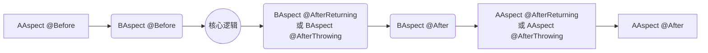

Java Spring 04 —— AOP

有接口 JDK
无接口 cglib

早期的时候 cglib 比较快，但是 cglib 已经很久没更新了，

# 序言
要理解 Spring AOP，必须先理解 [动态代理](https://kekaiyuan.github.io//2021/06/11/proxy/#%E5%8A%A8%E6%80%81%E4%BB%A3%E7%90%86)。

# 为什么要引入 AOP？
先通过以下代码的优化升级来感受**动态代理**和 **AOP** 的提出目的。

----------

现在实现一个计算器类，能够实现两个数字的加、减、乘、除。

```java
public class MyCalculator {
    public Integer add(Integer i, Integer j) {
        return i + j;
    }

    public Integer sub(Integer i, Integer j) {
        return i - j;
    }

    public Integer mul(Integer i, Integer j) {
        return i * j;
    }

    public Integer div(Integer i, Integer j) {
        return i / j;
    }
}
```

测试
```java
MyCalculator myCalculator = new MyCalculator();
System.out.println(myCalculator.add(6, 6));
System.out.println(myCalculator.sub(6, 6));
System.out.println(myCalculator.mul(6, 6));
System.out.println(myCalculator.div(6, 6));
```
结果
```java
12
0
36
1
```

----------

输出过于简单，增加一些信息
```java
public class MyCalculator implements Calculator {

    public Integer add(Integer i, Integer j) {
        System.out.println("add 方法开始执行，参数为：" + i + "," + j);
        Integer result = i + j;
        System.out.println("add 方法完成，结果为：" + result + "\n");
        return result;
    }

    public Integer sub(Integer i, Integer j) {
        System.out.println("sub 方法开始执行，参数为：" + i + "," + j);
        Integer result = i - j;
        System.out.println("sub 方法完成，结果为：" + result + "\n");
        return result;
    }

    public Integer mul(Integer i, Integer j) {
        System.out.println("mul 方法开始执行，参数为：" + i + "," + j);
        Integer result = i * j;
        System.out.println("mul 方法完成，结果为：" + result + "\n");
        return result;
    }

    public Integer div(Integer i, Integer j) {
        System.out.println("div 方法开始执行，参数为：" + i + "," + j);
        Integer result = i / j;
        System.out.println("div 方法完成，结果为：" + result + "\n");
        return result;
    }

}
```
测试
```java
MyCalculator myCalculator = new MyCalculator();
myCalculator.add(6, 6);
myCalculator.sub(6, 6);
myCalculator.mul(6, 6);
myCalculator.div(6, 6);
```
结果
```
add 方法开始执行，参数为：6,6
add 方法完成，结果为：12

sub 方法开始执行，参数为：6,6
add 方法完成，结果为：0

mult 方法开始执行，参数为：6,6
add 方法完成，结果为：36

div 方法开始执行，参数为：6,6
add 方法完成，结果为：1

```


----------

四个方法中有大量的重复代码，尝试提取出来，写一个工具类
```java
public class LogUtil01 {

    public static void start(Method method, Object... objects) {
        System.out.println(method.getName() + " 方法开始执行，参数是：" + Arrays.asList(objects));
    }

    public static void stop(Method method, Object... objects) {
        System.out.println(method.getName() + " 方法执行结束，结果是：" + Arrays.asList(objects) + "\n");
    }

    public static void logException(Method method, Exception e) {
        System.out.print(method.getName() + " 方法出现异常：");
        e.printStackTrace(System.out);
    }

    public static void end(Method method) {
        System.out.println(method.getName() + " 方法结束");
    }
}
```
修改 MyCalculator 类
```java
public class MyCalculator implements Calculator {

    public Integer add(Integer i, Integer j) throws NoSuchMethodException {
        Method add = MyCalculator.class.getMethod("add", Integer.class, Integer.class);
        LogUtil01.start(add, i, j);
        Integer result = i + j;
        LogUtil01.stop(add, result);
        return result;
    }

    public Integer sub(Integer i, Integer j) throws NoSuchMethodException {
        Method sub = MyCalculator.class.getMethod("sub", Integer.class, Integer.class);
        LogUtil01.start(sub, i, j);
        Integer result = i - j;
        LogUtil01.stop(sub, result);
        return result;
    }

    public Integer mul(Integer i, Integer j) throws NoSuchMethodException {
        Method mul = MyCalculator.class.getMethod("mul", Integer.class, Integer.class);
        LogUtil01.start(mul, i, j);
        Integer result = i * j;
        LogUtil01.stop(mul, result);
        return result;
    }

    public Integer div(Integer i, Integer j) throws NoSuchMethodException {
        Method div = MyCalculator.class.getMethod("div", Integer.class, Integer.class);
        LogUtil01.start(div, i, j);
        Integer result = i / j;
        LogUtil01.stop(div, result);
        return result;
    }

}

```
测试
```java
MyCalculator myCalculator = new MyCalculator();
myCalculator.add(6, 6);
myCalculator.sub(6, 6);
myCalculator.mul(6, 6);
myCalculator.div(6, 6);
```
结果
```
add 方法开始执行，参数是：[6, 6]
add 方法执行结束，结果是：[12]

sub 方法开始执行，参数是：[6, 6]
sub 方法执行结束，结果是：[0]

mul 方法开始执行，参数是：[6, 6]
mul 方法执行结束，结果是：[36]

div 方法开始执行，参数是：[6, 6]
div 方法执行结束，结果是：[1]

```

如果是面向对象编程的话，这样的代码已经很棒了。

但仔细阅读代码，有没有一种切入的感觉？<br>
—— LogUtil01 类的方法像切片一样，切入到了 MyCalculator 类的方法中。

那我能不能把 LogUtil01 类的方法**动态性地切入到任何一个类的任何一个方法中**？

何为动态性？<br>
上文就是静态的，MyCalculator 类调用 LogUtil 类是写入程序中的，是一开始就定好的，执行多少遍，结果都一样。<br>
而如果是动态的，那么程序将在执行过程中，将 LogUtil 类的方法切入到某个类的方法中（程序运行前并未写入该类中）。

这就是 [动态代理](https://kekaiyuan.github.io//2021/06/11/proxy/#%E5%8A%A8%E6%80%81%E4%BB%A3%E7%90%86)。<br>
不理解动态代理的同学请戳上方链接，下文直接贴代码。


----------


将 MyCalculator 类还原为最简单的版本
```java
public class MyCalculator {
    public Integer add(Integer i, Integer j) {
        return i + j;
    }

    public Integer sub(Integer i, Integer j) {
        return i - j;
    }

    public Integer mul(Integer i, Integer j) {
        return i * j;
    }

    public Integer div(Integer i, Integer j) {
        return i / j;
    }
}
```

### Cglib 的动态代理
Cglib 是一个额外的 Jar 包，通过该 Jar 包实现动态代理比较简单，**不需要实现接口**。

其 Maven 依赖为
```xml
<dependency>
	<groupId>cglib</groupId>
	<artifactId>cglib</artifactId>
	<version>3.3.0</version>
</dependency>
```

```java
public class CglibProxy {

    public static Object getProxy(Class clz) {
        Enhancer enhancer = new Enhancer();
        enhancer.setSuperclass(clz);

        enhancer.setCallback(new MethodInterceptor() {
            public Object intercept(Object o, Method method, Object[] objects, MethodProxy methodProxy) throws IOException {
                Object result = null;
                try {
                    LogUtil01.start(method, objects);
                    result = methodProxy.invokeSuper(o,objects);
                    LogUtil01.stop(method, result);
                } catch (Exception e) {
                    LogUtil01.logException(method, e);
                } catch (Throwable throwable) {
                    throwable.printStackTrace();
                } finally {
                    LogUtil01.end(method);
                }
                return result1;
            }
        });

        Object proxy = enhancer.create();
        return proxy;
    }
}
```
测试
```java
MyCalculator proxy = (MyCalculator) CglibProxy.getProxy(MyCalculator.class);
proxy.add(6, 6);
proxy.sub(6, 6);
proxy.mul(6, 6);
proxy.div(6, 0);
```
结果
```
add 方法开始执行，参数是：[6, 6]
add 方法执行结束，结果是：[12]
add 方法结束

sub 方法开始执行，参数是：[6, 6]
sub 方法执行结束，结果是：[0]
sub 方法结束

mul 方法开始执行，参数是：[6, 6]
mul 方法执行结束，结果是：[36]
mul 方法结束

div 方法开始执行，参数是：[6, 0]
div 方法出现异常：java.lang.ArithmeticException: / by zero
	...(此处省略一万行异常信息)
div 方法结束
```
LogUtil 类添加了异常处理，然后调用时进行了 `6/0` 的操作，成功地处理了除 0 异常。

### JDK 自带的动态代理
JDK 本身就能够实现动态代理，只不过需要**实现接口**。

定义接口
```java
public interface Calculator {

    public Integer add(Integer i, Integer j) throws NoSuchMethodException;

    public Integer sub(Integer i, Integer j) throws NoSuchMethodException;

    public Integer mul(Integer i, Integer j) throws NoSuchMethodException;

    public Integer div(Integer i, Integer j) throws NoSuchMethodException;
}
```
将 MyCalculator 类实现该接口
```java
public class MyCalculator implements Calculator {
	...
}
```
实现动态代理
```java
public class DynamicProxy {

    public static Object getProxy(final Object object) {
        ClassLoader loader = object.getClass().getClassLoader();
        Class<?>[] interfaces = object.getClass().getInterfaces();

        InvocationHandler h = new InvocationHandler() {
            public Object invoke(Object proxy, Method method, Object[] args) throws IOException {
                Object result = null;
                try {
                    LogUtil01.start(method, args);
                    result = method.invoke(object, args);
                    LogUtil01.stop(method, result);
                } catch (Exception e) {
                    LogUtil01.logException(method, e);
                } finally {
                    LogUtil01.end(method);
                }
                return result;
            }
        };

        Object proxy = Proxy.newProxyInstance(loader, interfaces, h);
        return proxy;
    }
}
```
测试
```
add 方法开始执行，参数是：[6, 6]
add 方法执行结束，结果是：[12]
add 方法结束

sub 方法开始执行，参数是：[6, 6]
sub 方法执行结束，结果是：[0]
sub 方法结束

mul 方法开始执行，参数是：[6, 6]
mul 方法执行结束，结果是：[36]
mul 方法结束

div 方法开始执行，参数是：[6, 0]
div 方法出现异常：java.lang.reflect.InvocationTargetException
	...(此处省略一万行异常信息)
div 方法结束
```

# 什么是 AOP？

经过前面的几个案例，我们已经理解了动态代理的作用和好处。

但是以上的方式依然不够好：
1. 需要手写动态代理的源码，比较麻烦。
2. 实现了动态代理后，被代理类的所有方法都会被代理，无法只代理类中的**一部分**方法。 

- AOP<br>
	Aspect Oriented Programming<br>
	**面向切面编程**
- OOP<br>
	Object Oriented Programming<br>
	**面向对象编程**

AOP 是基于 OOP 提出的一种新的编程思想。

现在把执行某个类的某个方法看作一段**轨道**。<br>
一个程序，会有多个类，每个类又会有多个方法，总共就有**许多轨道**。<br>
通过 AOP ，我们可以把这些方法的执行过程**切开**，然后在切开的位置装入额外的功能代码。<br>
这就是面向切面编程——将某段代码**动态切入**到指定方法的指定位置中去。

上文的动态代理就属于 AOP 的范畴。<br>
把方法的执行过程切分：
- 在方法开始运行前，切入了 `LogUtil01.start()` 方法
- 在方法捕获异常时，切入了 `LogUtil01.logException()` 方法
- 在方法得到计算结果后，切入了 `LogUtil01.stop()` 方法
- 在方法结束后，切入了 `LogUtil01.end()` 方法

##### AOP的核心概念及术语

- 切面（Aspect）: 指关注点模块化，这个关注点可能会横切多个对象。事务管理是企业级Java应用中有关横切关注点的例子。 在Spring AOP中，切面可以使用通用类基于模式的方式（schema-based approach）或者在普通类中以`@Aspect`注解（@AspectJ 注解方式）来实现。
- 连接点（Join point）: 在程序执行过程中某个特定的点，例如某个方法调用的时间点或者处理异常的时间点。在Spring AOP中，一个连接点总是代表一个方法的执行。
- 通知（Advice）: 在切面的某个特定的连接点上执行的动作。通知有多种类型，包括“around”, “before” and “after”等等。通知的类型将在后面的章节进行讨论。 许多AOP框架，包括Spring在内，都是以拦截器做通知模型的，并维护着一个以连接点为中心的拦截器链。
- 切点（Pointcut）: 匹配连接点的断言。通知和切点表达式相关联，并在满足这个切点的连接点上运行（例如，当执行某个特定名称的方法时）。切点表达式如何和连接点匹配是AOP的核心：Spring默认使用AspectJ切点语义。
- 引入（Introduction）: 声明额外的方法或者某个类型的字段。Spring允许引入新的接口（以及一个对应的实现）到任何被通知的对象上。例如，可以使用引入来使bean实现 `IsModified`接口， 以便简化缓存机制（在AspectJ社区，引入也被称为内部类型声明（inter））。
- 目标对象（Target object）: 被一个或者多个切面所通知的对象。也被称作被通知（advised）对象。既然Spring AOP是通过运行时代理实现的，那么这个对象永远是一个被代理（proxied）的对象。
- AOP代理（AOP proxy）:AOP框架创建的对象，用来实现切面契约（aspect contract）（包括通知方法执行等功能）。在Spring中，AOP代理可以是JDK动态代理或CGLIB代理。
- 织入（Weaving）: 把切面连接到其它的应用程序类型或者对象上，并创建一个被被通知的对象的过程。这个过程可以在编译时（例如使用AspectJ编译器）、类加载时或运行时中完成。 Spring和其他纯Java AOP框架一样，是在运行时完成织入的。

##### AOP的通知类型

- 前置通知（Before advice）: 在连接点之前运行但无法阻止执行流程进入连接点的通知（除非它引发异常）。
- 后置返回通知（After returning advice）:在连接点正常完成后执行的通知（例如，当方法没有抛出任何异常并正常返回时）。
- 后置异常通知（After throwing advice）: 在方法抛出异常退出时执行的通知。
- 后置通知（总会执行）（After (finally) advice）: 当连接点退出的时候执行的通知（无论是正常返回还是异常退出）。
- 环绕通知（Around Advice）:环绕连接点的通知，例如方法调用。这是最强大的一种通知类型，。环绕通知可以在方法调用前后完成自定义的行为。它可以选择是否继续执行连接点或直接返回自定义的返回值又或抛出异常将执行结束。

##### AOP的应用场景

- 日志管理
- 权限认证
- 安全检查
- 事务控制


# Spring AOP 的简单使用
## 导入 Jar 包
通过 Maven 添加以下依赖
```xml
<!-- https://mvnrepository.com/artifact/cglib/cglib -->
<dependency>
	<groupId>cglib</groupId>
	<artifactId>cglib</artifactId>
	<version>3.3.0</version>
</dependency>
<!-- https://mvnrepository.com/artifact/org.aspectj/aspectjweaver -->
<dependency>
	<groupId>org.aspectj</groupId>
	<artifactId>aspectjweaver</artifactId>
	<version>1.9.5</version>
</dependency>
<!-- https://mvnrepository.com/artifact/aopalliance/aopalliance -->
<dependency>
	<groupId>aopalliance</groupId>
	<artifactId>aopalliance</artifactId>
	<version>1.0</version>
</dependency>
<!-- https://mvnrepository.com/artifact/org.springframework/spring-aspects -->
<dependency>
	<groupId>org.springframework</groupId>
	<artifactId>spring-aspects</artifactId>
	<version>5.2.3.RELEASE</version>
</dependency>
```

## 编写切面类 LogUtil02
```java
@Aspect
@Component
public class LogUtil02 {

    @Before("execution( public Integer com.kky.service.MyCalculator.add( Integer, Integer))")
    public static void start() {
        System.out.println(" 方法开始执行，参数是：");
    }

    @AfterReturning("execution( public Integer com.kky.service.MyCalculator.add( Integer, Integer))")
    public static void stop() {
        System.out.println(" 方法执行完成，结果是：");
    }

    @AfterThrowing("execution( public Integer com.kky.service.MyCalculator.add( Integer, Integer))")
    public static void logException() {
        System.out.println(" 方法出现异常：");
    }

    @After("execution( public Integer com.kky.service.MyCalculator.add( Integer, Integer))")
    public static void end() {
        System.out.println(" 方法结束。\n");
    }
}
```
简单解析该代码：

`@Component`<br>
将该类注册到 IOC 容器中

`@Aspect`<br>
指明该类为切面类

通知类型。<br>
表明切入到方法中的哪个**位置**。
- `@Before` 前置通知<br>
	在目标方法之前运行
- `@After` 后置通知<br>
	在目标方法之后运行
- `@AfterReturning` 返回通知<br>
	在目标方法正常返回之后
- `@AfterThrowing` 异常通知<br>
	在目标方法抛出异常后开始运行
- `@Around` 环绕通知<br>
	环绕

切入点表达式 `execution(访问修饰符 返回值类型 方法全称)`
表明切入到什么**方法**中。<br>

像`execution( public Integer com.kky.service.MyCalculator.add( Integer, Integer))`<br>
就表示切入到 `com.kky.service.MyCalculator` 类的 `public Integer add(Integer i, Integer j)` 方法中。

## 编写配置
请先将前文中的
- LogUtil 类添加 `@Component` 注解
- MyCalculator 类添加 `@Service` 注解

以将它们加载到 IOC 容器中。

然后修改 application.xml 文件
```xml
<?xml version="1.0" encoding="UTF-8"?>
<beans xmlns="http://www.springframework.org/schema/beans"
       xmlns:xsi="http://www.w3.org/2001/XMLSchema-instance"
       xmlns:context="http://www.springframework.org/schema/context"
       xmlns:aop="http://www.springframework.org/schema/aop"
       xsi:schemaLocation="http://www.springframework.org/schema/beans
       http://www.springframework.org/schema/beans/spring-beans.xsd
       http://www.springframework.org/schema/context
       http://www.springframework.org/schema/context/spring-context.xsd
       http://www.springframework.org/schema/aop
       http://www.springframework.org/schema/aop/spring-aop.xsd
">
    <!--开启自动扫描-->
    <context:component-scan base-package="com.kky"></context:component-scan>
    <!--开启 aop 的注解功能-->
    <aop:aspectj-autoproxy></aop:aspectj-autoproxy>
</beans>
```

## 测试
```java
ClassPathXmlApplicationContext context = new ClassPathXmlApplicationContext("applicationContext.xml");
Calculator bean = context.getBean(Calculator.class);
bean.add(6, 6);
```
结果
```java
 方法开始执行，参数是：
 方法执行完成，结果是：
 方法结束。
```

## 动态代理的类型
前文介绍了两种动态代理：
1. 使用 JDK 实现
2. 使用 Cglib 实现

两者最大的区别在于是否需要**接口**。

而 Spring AOP 底层原理也是这两种动态代理。

那么到底使用哪种呢？

Spring AOP 会自动选择：
- 有接口，使用 **JDK** 实现
- 无接口，使用 **Cglib** 实现

看上去很方便对吧，无论有没有接口，我们使用 Spring AOP 的方法都是一样的，不需要关心细节。

唯一有一点要**注意**：<br>
**当使用接口时，从 IOC 容器中取对象必须使用接口类型！**

```java
@Service
public class MyCalculator implements Calculator {
	...
}
```
可以看到，此时的 MyCalculator 类继承于 Calculator **接口**，Spring AOP 会自动使用 JDK 来实现动态代理。

此时调用动态代理必须使用如下方式：
```java
...
Calculator bean = context.getBean(Calculator.class);
...
```
使用的是 `Calculator.class`

如果是这样
```java
...
MyCalculator bean = context.getBean(MyCalculator.class);
...
```
则会报错
```java
org.springframework.beans.factory.NoSuchBeanDefinitionException: No qualifying bean of type 'com.kky.service.MyCalculator' available
```
找不到该类，说明 IOC 容器注册该 bean 对象时使用的是**接口的类型**。

# 详解 Spring AOP
上文只是简单地介绍了 Spring AOP 如何使用。<br>
这里对其做出详解。

Spring AOP 一共有五种通知，可以分为两类：
- 普通通知
	- 前置通知
	- 后置返回通知
	- 后置异常通知
	- 后置通知
- 环绕通知

在这里先讲解普通通知，再讲解环绕通知。

## 切入点表达式
```java
execution(public Integer com.kky.service.MyCalculator.add(Integer,Integer))
```
这是最精准的匹配方式，规定了修饰符、返回值、完全限定名、方法名、形参。<br>
这种匹配方式至多匹配到一个方法，是最准确的。

但是在实际中，我们并不需要这么准确，因为**一对一**意味着代码量的**增加**。<br>
我们更希望实现**一对多**，所以有了**通配符**。

通配符有两种 `*` 和 `..`

### 通配符

#### \*

1. 匹配一个或者多个字符
	```java
	execution( public Integer com.kky.service.MyCalculator.a*( Integer, Integer))
	```
	可匹配所有以 a 开头的方法，包括 ab, ac, abc, add...<br>
	```java
	execution( public Integer com.kky.service.MyCalculator.*( Integer, Integer))
	```
	匹配所有方法。<br>
	对于类名和包名同样有效。
2. 匹配任意类型的参数
	```java
	execution( public Integer com.kky.service.MyCalculator.add( Integer, *))
	```
	第二个参数的类型将不做限制
3. 匹配路径<br>
	当使用 * 匹配路径时，根据使用方法不同，其效果也不同
	- 匹配多层路径
		- 只有 *
			```java
			execution( public Integer *( Integer, Integer))
			```
			将匹配所有类的所有方法。
		- \* + 方法名
			```java
			execution( public Integer *.add( Integer, Integer))
			```
			匹配所有类的 add 方法
	- 匹配单层路径<br>
		除了以上两种使用方法，* 只能匹配单层路径，例如
		```java
		execution( public Integer *.MyCalculator.add( Integer, *))
		```
		只能匹配最外层路径下的 MyCalculator 类，而 `com.kky.service.MyCalculator` 类是匹配不到的。
4. 匹配返回值
	```java
	execution( public * com.kky.service.MyCalculator.add( Integer, Integer))
	```
	可匹配所有的返回值
5. * 不能用于匹配修饰符。<br>
	如果有需要，请直接**省略**修饰符。
	```java
	execution( Integer com.kky.service.MyCalculator.add( Integer, Integer))
	```
	此时将匹配所有的修饰符

#### ..
1. 可匹配参数，其数量和类型不限。
	```java
	execution( public Integer com.kky.service.MyCalculator.add(..))
	```
	此时参数列表没有限制
2. 匹配多层路径
	```java
	execution( public Integer com..MyCalculator.add( Integer, Integer))
	```
	此时可以匹配到 `com.kky.service.MyCalculator`

#### 总结
通配符的功能很强大，请根据需要，合理地制定匹配规则。

当需要为**所有类的所有方法**增加动态代理时，可以使用以下**最偷懒的方式**：
```java
execution( * *(..))
```

### 逻辑运算 && || !
表达式除了使用通配符扩大匹配范围，更可以使用逻辑运算。<br>
其运算和 Java 中的逻辑运算一样。

- `&&`<br>
	同时满足两个表达式
	```java
	execution( public Integer com.kky.service.MyCalculator.a*( Integer, Integer)) && execution( public Integer com.kky.service.MyCalculator.*d( Integer, Integer))
	```
	方法名以 a 开头，以 d 结尾
- `||`<br>
	满足一个表达式即可
- `!`<br>
	除了这个表达式外的地方都可以切入

## 抽取表达式
可以看到，表达式是有重复性的，往往一个切面类中所有通知的表达式都是同一个。<br>
此时可以对表达式进行抽取，简化代码。

1. 声明一个空方法并添加 `@PointCut` 注解
2. 用该方法替换通知中的表达式

```java
```java
@Aspect
@Component
public class LogUtil02 {

	@PointCut("execution( public Integer com.kky.service.MyCalculator.add( Integer, Integer))")
	public void myPointCut(){}

    @Before("myPointCut()")
    public static void start() {
        System.out.println(" 方法开始执行，参数是：");
    }

    @AfterReturning("myPointCut()")
    public static void stop() {
        System.out.println(" 方法执行完成，结果是：");
    }

    @AfterThrowing("myPointCut()")
    public static void logException() {
        System.out.println(" 方法出现异常：");
    }

    @After("myPointCut()")
    public static void end() {
        System.out.println(" 方法结束。\n");
    }
}
```


## 通知的执行顺序


###### 		2、通知方法的执行顺序

	在之前的代码中大家一直对通知的执行顺序有疑问，其实执行的结果并没有错，大家需要注意：

	1、正常执行：@Before--->@After--->@AfterReturning

	2、异常执行：@Before--->@After--->@AfterThrowing

## 如何定义通知方法的参数
通知方法在定义时对于访问修饰符、返回值都没有明确要求。
- 无论是 `public` 还是 `private` ，通知方法都能够被调用
- 无论写不写返回值都不影响返回值的功能，一般不写

但是通知方法对于参数的要求特别严格，需要严格地遵照规范。

### JoinPoint
JoinPoint 可直接写入通知方法的参数列表，其包含了有关于被切入的方法的相关信息。

常用于获取方法名称和参数。
```java
@Component
@Aspect
public class LogUtil {

	@PointCut("execution( public Integer com.kky.service.MyCalculator.add( Integer, Integer))")
	public void myPointCut(){}

    @Before("myPointCut()")
    public static void start(JoinPoint joinPoint){
		String name = joinPoint.getSignature().getName();
        Object[] args = joinPoint.getArgs();
        System.out.println(name+" 方法开始执行，参数是："+ Arrays.asList(args));
    }

    @AfterReturning("myPointCut()")
    public static void stop(JoinPoint joinPoint) {
        System.out.println(joinPoint.getSignature().getName() +
                " 方法执行完成，结果是：");
    }

    @AfterThrowing("myPointCut()")
    public static void logException(JoinPoint joinPoint) {
        System.out.println(joinPoint.getSignature().getName() + " 方法出现异常：");
    }

    @After("myPointCut()")
    public static void end(JoinPoint joinPoint) {
        System.out.println(joinPoint.getSignature().getName() + " 方法结束。");
    }

}
```
测试
```java
ClassPathXmlApplicationContext context = new ClassPathXmlApplicationContext("applicationContext.xml");
Calculator bean = context.getBean(Calculator.class);
bean.add(6, 6);
```
结果
```java
add 方法开始执行，参数是：[6, 6]
add 方法结束。
add 方法执行完成，结果是：
```
成功获取到了**方法名**和**参数**，但是没有返回值。


### 配置注解的参数

| `@Before()` | `@AfterReturning` | `@AfterThrowing` | `@After` | `@Round` |
| :--: | :--: | :--: | :--: | :--: |
| `value` | `value` | `value` | `value` | `value` |
| `argName` | `argName` | `argName` | `argName` | `argName` |
|  | `pointcut` | `pointcut` |  |  |
|  | `returning` | `throwing` |  |  |

#### value
`value` 就是切入点表达式。<br>
当注解中只有切入点表达式时 `value` 可以**省略**。<br>
当注解中有其他参数时需要**显式**地写出 `value` 以**区分**。

```java
@Component
@Aspect
public class LogUtil {

	@PointCut("execution( public Integer com.kky.service.MyCalculator.add( Integer, Integer))")
	public void myPointCut(){}

    @Before(value = "myPointCut()")
    public static void start(JoinPoint joinPoint){
		String name = joinPoint.getSignature().getName();
        Object[] args = joinPoint.getArgs();
        System.out.println(name+" 方法开始执行，参数是："+ Arrays.asList(args));
    }

	...

}
```

#### argName
`argName` 用于配置被切入方法的**参数**。
```java
@Component
@Aspect
public class LogUtil {

	@PointCut("execution( public Integer com.kky.service.MyCalculator.add( Integer, Integer))")
	public void myPointCut(){}

    @Before(value = "myPointCut() && args(i,j)", argNames = "i,j")
    public static void start(Integer i, Integer j) {
        System.out.println(" 方法开始执行，参数是：" + i + "," + j);
    }

	...

}
```
1. 首先要在 `value` 里配置 `args(i,j)`<br>
	1. 强制限定匹配的方法只有两个参数。<br>
		因为 Spring 需要通过限制方法参数来确定匹配的方法是哪一个。
	2. 为参数起别名，为了之后的调用。
2. 在注解中添加 `argNames` 参数。
3. 在通知方法中写入参数。

注意：<br>
这三个地方必须**一致**！

测试：
```java
ClassPathXmlApplicationContext context = new ClassPathXmlApplicationContext("applicationContext.xml");
Calculator bean = context.getBean(Calculator.class);
bean.add(6, 6);
```
结果
```java
 方法开始执行，参数是：6,6
...
```

#### returning

用于获取方法的返回值

在 `@AfterReturning` 注解中添加 `returning` 参数，并写入方法形参。

```java
@Aspect
@Component
public class LogUtil02 {

	...
	
    @AfterReturning(value = "execution( public Integer com.kky.service.MyCalculator.*(Integer,Integer))", returning =
            "result")
    public static void stop(JoinPoint joinPoint, Object result) {
        System.out.println(joinPoint.getSignature().getName() +
                " 方法执行完成，结果是：" + result);
    }

	...

}

```
重新测试结果
```java
add 方法开始执行，参数是：[6, 6]
add 方法结束。
add 方法执行完成，结果是：12
```


#### throwing

获取异常信息

在 `@AfterThrowing` 注解中添加 `throwing` 参数，并写入方法形参。

```java
@AfterThrowing(value = "execution( public Integer com.kky.service.MyCalculator.*(Integer,Integer))", throwing =
		"e")
public static void logException(JoinPoint joinPoint, Exception e) {
	System.out.println(joinPoint.getSignature().getName() + " 方法出现异常：" + e);
}
```
测试除 0
```java
ClassPathXmlApplicationContext context = new ClassPathXmlApplicationContext("applicationContext.xml");
Calculator bean = context.getBean(Calculator.class);
bean.div(6, 0);
```
结果
```java
div 方法结束。
div 方法出现异常：java.lang.ArithmeticException: / by zero

java.lang.ArithmeticException: / by zero
...(此处省略异常详情)
```


###### 		6、环绕通知的使用

LogUtil.java

```java
package com.mashibing.util;

import org.aspectj.lang.JoinPoint;
import org.aspectj.lang.ProceedingJoinPoint;
import org.aspectj.lang.annotation.*;
import org.springframework.stereotype.Component;

import java.util.Arrays;

@Component
@Aspect
public class LogUtil {
    @Pointcut("execution( public int com.kky.services.MyCalculator.*(int,int))")
    public void myPoint(){}
    
    /**
     * 环绕通知是spring中功能最强大的通知
     * @param proceedingJoinPoint
     * @return
     */
    @Around("myPoint()")
    public Object myAround(ProceedingJoinPoint proceedingJoinPoint){
        Object[] args = proceedingJoinPoint.getArgs();
        String name = proceedingJoinPoint.getSignature().getName();
        Object proceed = null;
        try {
            System.out.println("环绕前置通知:"+name+"方法开始，参数是"+Arrays.asList(args));
            //利用反射调用目标方法，就是method.invoke()
            proceed = proceedingJoinPoint.proceed(args);
            System.out.println("环绕返回通知:"+name+"方法返回，返回值是"+proceed);
        } catch (Throwable e) {
            System.out.println("环绕异常通知"+name+"方法出现异常，异常信息是："+e);
        }finally {
            System.out.println("环绕后置通知"+name+"方法结束");
        }
        return proceed;
    }
}
```

总结：环绕通知的执行顺序是优于普通通知的，具体的执行顺序如下：

环绕前置-->普通前置-->目标方法执行-->环绕正常结束/出现异常-->环绕后置-->普通后置-->普通返回或者异常。

但是需要注意的是，如果出现了异常，那么环绕通知会处理或者捕获异常，普通异常通知是接收不到的，因此最好的方式是在环绕异常通知中向外抛出异常。

# 	多切面类的运行顺序
如果要执行多个切面类，顺序是怎样的？

默认情况下，根据切面类的**字典序** **升序**执行。

假如现有切面类 AAspect 和 BAspect<br>
此时先执行 AAspect ，再执行 BAspect

具体的执行流程是这样的




在spring中，默认是按照切面名称的字典顺序进行执行的，但是如果想自己改变具体的执行顺序的话，可以使用@Order注解来解决，数值越小，优先级越高。

LogUtil.java

```java
package com.mashibing.util;

import org.aspectj.lang.JoinPoint;
import org.aspectj.lang.ProceedingJoinPoint;
import org.aspectj.lang.annotation.*;
import org.springframework.stereotype.Component;

import java.util.Arrays;

@Component
@Aspect
@Order(2)
public class LogUtil {
    @Pointcut("execution( public int com.kky.services.MyCalculator.*(int,int))")
    public void myPoint(){}
    @Before("myPoint()")
    public static void start(JoinPoint joinPoint){
//        System.out.println("XXX方法开始执行，使用的参数是："+ Arrays.asList(objects));
//        System.out.println(method.getName()+"方法开始执行，参数是："+ Arrays.asList(objects));
        Object[] args = joinPoint.getArgs();
        String name = joinPoint.getSignature().getName();
        System.out.println("Log:"+name+"方法开始执行，参数是："+ Arrays.asList(args));
    }

    @AfterReturning(value = "myPoint()",returning = "result")
    public static void stop(JoinPoint joinPoint,Object result){
//        System.out.println("XXX方法执行结束，结果是："+ Arrays.asList(objects));
//        System.out.println(method.getName()+"方法执行结束，结果是："+ Arrays.asList(objects));
        String name = joinPoint.getSignature().getName();
        System.out.println("Log:"+name+"方法执行完成，结果是："+result);

    }

    @AfterThrowing(value = "myPoint()",throwing = "exception")
    public static void logException(JoinPoint joinPoint,Exception exception){
//        System.out.println(method.getName()+"方法出现异常："+ e.getMessage());
        String name = joinPoint.getSignature().getName();
        System.out.println("Log:"+name+"方法出现异常："+exception.getMessage());
    }

    @After("myPoint()")
    private int end(JoinPoint joinPoint){
//        System.out.println(method.getName()+"方法结束");
        String name = joinPoint.getSignature().getName();
        System.out.println("Log:"+name+"方法结束");
        return 0;
    }

    /**
     * 环绕通知是spring中功能最强大的通知
     * @param proceedingJoinPoint
     * @return
     */
    //@Around("myPoint()")
    public Object myAround(ProceedingJoinPoint proceedingJoinPoint){
        Object[] args = proceedingJoinPoint.getArgs();
        String name = proceedingJoinPoint.getSignature().getName();
        Object proceed = null;
        try {
            System.out.println("环绕前置通知:"+name+"方法开始，参数是"+Arrays.asList(args));
            //利用反射调用目标方法，就是method.invoke()
            proceed = proceedingJoinPoint.proceed(args);
            System.out.println("环绕返回通知:"+name+"方法返回，返回值是"+proceed);
        } catch (Throwable e) {
            System.out.println("环绕异常通知"+name+"方法出现异常，异常信息是："+e);
        }finally {
            System.out.println("环绕后置通知"+name+"方法结束");
        }
        return proceed;
    }
}
```

SecurityAspect.java

```java
package com.mashibing.util;

import org.aspectj.lang.JoinPoint;
import org.aspectj.lang.ProceedingJoinPoint;
import org.aspectj.lang.annotation.*;
import org.springframework.stereotype.Component;

import java.util.Arrays;

@Component
@Aspect
@Order(1)
public class SecurityAspect {

    @Before("com.mashibing.util.LogUtil.myPoint()")
    public static void start(JoinPoint joinPoint){
        Object[] args = joinPoint.getArgs();
        String name = joinPoint.getSignature().getName();
        System.out.println("Security:"+name+"方法开始执行，参数是："+ Arrays.asList(args));
    }

    @AfterReturning(value = "com.mashibing.util.LogUtil.myPoint()",returning = "result")
    public static void stop(JoinPoint joinPoint,Object result){
        String name = joinPoint.getSignature().getName();
        System.out.println("Security:"+name+"方法执行完成，结果是："+result);

    }

    @AfterThrowing(value = "com.mashibing.util.LogUtil.myPoint()",throwing = "exception")
    public static void logException(JoinPoint joinPoint,Exception exception){
        String name = joinPoint.getSignature().getName();
        System.out.println("Security:"+name+"方法出现异常："+exception.getMessage());
    }

    @After("com.mashibing.util.LogUtil.myPoint()")
    private int end(JoinPoint joinPoint){
        String name = joinPoint.getSignature().getName();
        System.out.println("Security:"+name+"方法结束");
        return 0;
    }

    /**
     * 环绕通知是spring中功能最强大的通知
     * @param proceedingJoinPoint
     * @return
     */
    //@Around("myPoint()")
    public Object myAround(ProceedingJoinPoint proceedingJoinPoint){
        Object[] args = proceedingJoinPoint.getArgs();
        String name = proceedingJoinPoint.getSignature().getName();
        Object proceed = null;
        try {
            System.out.println("环绕前置通知:"+name+"方法开始，参数是"+Arrays.asList(args));
            //利用反射调用目标方法，就是method.invoke()
            proceed = proceedingJoinPoint.proceed(args);
            System.out.println("环绕返回通知:"+name+"方法返回，返回值是"+proceed);
        } catch (Throwable e) {
            System.out.println("环绕异常通知"+name+"方法出现异常，异常信息是："+e);
        }finally {
            System.out.println("环绕后置通知"+name+"方法结束");
        }
        return proceed;
    }
}
```

如果需要添加环绕通知呢，具体的执行顺序又会是什么顺序呢？

因为环绕通知在进行添加的时候，是在切面层引入的，所以在哪个切面添加环绕通知，那么就会在哪个切面执行。

### 3、基于配置的AOP配置

之前我们讲解了基于注解的AOP配置方式，下面我们开始讲一下基于xml的配置方式，虽然在现在的企业级开发中使用注解的方式比较多，但是你不能不会，因此需要简单的进行配置，注解配置快速简单，配置的方式共呢个完善。

1、将所有的注解都进行删除

2、添加配置文件

aop.xml

```xml
<?xml version="1.0" encoding="UTF-8"?>
<beans xmlns="http://www.springframework.org/schema/beans"
       xmlns:xsi="http://www.w3.org/2001/XMLSchema-instance"
       xmlns:context="http://www.springframework.org/schema/context"
       xmlns:aop="http://www.springframework.org/schema/aop"
       xsi:schemaLocation="http://www.springframework.org/schema/beans
       http://www.springframework.org/schema/beans/spring-beans.xsd
       http://www.springframework.org/schema/context
       http://www.springframework.org/schema/context/spring-context.xsd
       http://www.springframework.org/schema/aop
       https://www.springframework.org/schema/aop/spring-aop.xsd
">

    <context:component-scan base-package="com.mashibing"></context:component-scan>
    <aop:aspectj-autoproxy></aop:aspectj-autoproxy>

    <bean id="logUtil" class="com.mashibing.util.LogUtil2"></bean>
    <bean id="securityAspect" class="com.mashibing.util.SecurityAspect"></bean>
    <bean id="myCalculator" class="com.kky.services.MyCalculator"></bean>
    <aop:config>
        <aop:pointcut id="globalPoint" expression="execution(public int com.kky.services.MyCalculator.*(int,int))"/>
        <aop:aspect ref="logUtil">
            <aop:pointcut id="mypoint" expression="execution(public int com.kky.services.MyCalculator.*(int,int))"/>
            <aop:before method="start" pointcut-ref="mypoint"></aop:before>
            <aop:after method="end" pointcut-ref="mypoint"></aop:after>
            <aop:after-returning method="stop" pointcut-ref="mypoint" returning="result"></aop:after-returning>
            <aop:after-throwing method="logException" pointcut-ref="mypoint" throwing="exception"></aop:after-throwing>
            <aop:around method="myAround" pointcut-ref="mypoint"></aop:around>
        </aop:aspect>
        <aop:aspect ref="securityAspect">
            <aop:before method="start" pointcut-ref="globalPoint"></aop:before>
            <aop:after method="end" pointcut-ref="globalPoint"></aop:after>
            <aop:after-returning method="stop" pointcut-ref="globalPoint" returning="result"></aop:after-returning>
            <aop:after-throwing method="logException" pointcut-ref="globalPoint" throwing="exception"></aop:after-throwing>
            <aop:around method="myAround" pointcut-ref="mypoint"></aop:around>
        </aop:aspect>
    </aop:config>
</beans>
```


# 源码链接
该文章源码链接 [Github](url)