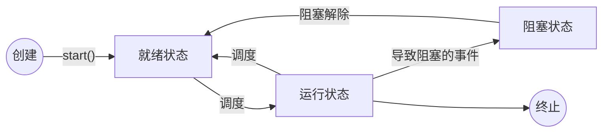

Java 学习笔记之 10 —— 线程
 
# 基本概念

## 程序 Program
程序是一个指令集合，是静态的。

我们平时编程所写的代码，就是程序。

## 进程 Process
进程指的是正在执行中的程序，是一个动态的概念。

一台电脑中可以运行多个进程，比如我们经常一边登着 QQ 和微信，一边放着音乐或视频，还打着游戏……<br>
它们之间互不干扰。

为什么？

这是因为 CPU 会把时间划分为一个个固定的时间片，假定时间片大小为 5ms 。

那么第一个 5ms ：运行 QQ 进程。<br>
第二个 5ms ：运行音乐或视频软件的进程。<br>
第三个 5ms ：运行游戏进程。<br>
第四个 5ms ：运行 QQ 进程。<br>
……

CPU 会以一种极快的速度切换所执行的进程，这使得在人眼中看来：**这些进程像是同时进行的**。

这就是进程的**宏观并行（同时执行）**，**微观交替执行**。

进程由三部分组成：
1. PCB 进程控制块

	PCB中记录了操作系统所需的，用于描述进程的当前情况以及控制进程运行的全部信息。<br>
	这是一个进程最重要的模块，有了它，系统才能识别这个进程，并为它分配资源，使得它可以运行。
	
2. 代码段

	存放该进程对应的程序源码。<br>
	即程序员们所编写的那些代码。
	
3. 数据段

	存放着该进程的各类数据：原始数据，进程执行过程中产生的数据……
	
## 线程 Thread
电脑需要一种并行技术，使得一台电脑可以运行多个程序，所以有了进程的概念。

进程也需要一种并行技术，使得进程内部可以并行地执行某些东西。<br>
例如：游戏都有背景音乐。<br>
如果进程内部是顺序执行的：
```java
...
播放音乐
玩游戏
...
```
如果是这种设计，那么在音乐停止之前，我们无法玩游戏。<br>
我们想要的是这样的：
```java
...
一边播放音乐
一边玩游戏
...
```
就类似于电脑中：
```java
...
一边使用 QQ 和微信
一边听音乐或看视频
一边玩游戏
...
```
我们需要**进程的进程**，于是有了线程：进程中一个单一顺序的控制流。

操作系统将时间划分为固定大小的时间片，每个时间片服务一个进程。

进程内部再把时间片划分为更小的时间片，服务不同的线程。

这就使得一个进程也可以并行执行不同的任务。

线程和进程很类似，所以线程又被称为**轻量级进程**。

**注意：**<br>
- 进程是资源分配的最小单位。

	操作系统会给进程分配 CPU 、内存、外设等资源。<br>
	但是不会给线程分配资源，**所有线程共享其进程的资源**。<br>
	这也就意味着，线程之间的通信是非常简单的，因为它们共享内存。<br>
	它们可以随时从内存中取出其他线程的信息。<br>
	而进程之间的通信是非常困难的。<br>
	因为操作系统会阻止某进程访问其他进程的内存。
	
- 线程是调度的基本单位。

	操作系统划分时间片给进程，进程又把时间划分给线程。<br>
	所以真正执行任务的是线程。<br>
	
- 一个程序至少拥有一个线程。

	在 Java 中，Main 方法是程序的入口，这其实就是程序的**主线程**。
	
- 线程结束，其进程不一定结束。<br>
	进程结束，其所有线程统统结束。
	
- 进程和线程的数量没有上限。

	当然，进程和线程数量太多会引起很多问题，最常见的就是**死机**。


## 进程和线程的区别


| 区别     | 进程                                                         | 线程                                                         |
| -------- | ------------------------------------------------------------ | ------------------------------------------------------------ |
| 根本区别 | 作为资源分配的单位                                           | 调度和执行的单位                                             |
| 开销     | 每个进程都有独立的代码和数据空间(进程上下文)，<br />进程间的切换会有较大的开销。 | 线程可以看成时轻量级的进程，<br />同一类线程共享代码和数据空间，<br />每个线程有独立的运行栈和程序计数器(PC)，<br />线程切换的开销小。 |
| 所处环境 | 在操作系统中能同时运行多个任务(程序)                         | 在同一应用程序中有多个顺序流同时执行                         |
| 分配内存 | 系统在运行的时候会为每个进程分配不同的内存区域               | 除了CPU之外，<br />不会为线程分配内存（线程所使用的资源是它所属的进程的资源），<br />线程组只能共享资源 |
| 包含关系 | 没有线程的进程是可以被看作单线程的。<br />如果一个进程内拥有多个线程，<br />则执行过程不是一条线的，<br />而是多条线（线程）共同完成的。 | 线程是进程的一部分，<br />所以线程有的时候被称为是轻权进程或者轻量级进程。 |


 
# Java 中线程的实现
在Java中负责线程的这个功能的是Java.lang.Thread 这个类 

.可以通过创建 Thread 的实例来创建新的线程。 
.每个线程都是通过某个特定Thread对象所对应的方法run( )来完成其操作的，方法run( )称为线程体。 
.通过调用Thread类的start()方法来启动一个线程。 

 
 
 
## 继承 Thread 类 
操作步骤： 
1. 继承 Thread 类 
2. 重写 run() 方法

	run() 方法中的即是该线程的核心逻辑
	
3. 创建 Thread 对象，调用 start() 方法启动线程

```java
//继承 Thread 类
public class ThreadDemo extends Thread {

    //重写 run 方法
    @Override
    public void run() {
        for (int i = 0; i < 3; i++) {
            System.out.println(Thread.currentThread().getName() + "------" + i);
        }
    }

    public static void main(String[] args) {
        //创建对象
        ThreadDemo thread1 = new ThreadDemo();
        ThreadDemo thread2 = new ThreadDemo();

        //调用 start 方法
        thread1.start();
        thread2.start();
    }
}
```
结果
```java
Thread-0------0
Thread-1------0
Thread-0------1
Thread-1------1
Thread-0------2
Thread-1------2
```

注意：<br>
如果调用了线程对象的 run() 方法，只是单纯地调用了方法，并没有启动线程。
只有调用了线程对象的 start() 方法，才真正地开启了线程，使得并行执行。


 
##  实现 Runnable 接口 
操作步骤： 
1. 实现 Runnable 接口 
2. 重写 run() 方法 
3. 先创建 Runnable 对象
4. 通过 Runnable 对象创建 Thread 对象
5. 调用 start() 方法启动线程

```java
//实现 Runnable 接口
public class RunnableDemo implements Runnable {

    //重写 run() 方法
    @Override
    public void run() {
        for (int i = 0; i < 3; i++) {
            System.out.println(Thread.currentThread().getName() + "------" + i);
        }
    }

    public static void main(String[] args) {
        //先创建 Runnable 对象
        Runnable runnable1 = new RunnableDemo();
        Runnable runnable2 = new RunnableDemo();
        
        //通过 Runnable 对象创建 Thread 对象
        Thread thread1 = new Thread(runnable1);
        Thread thread2 = new Thread(runnable2);
        
        //调用 start() 方法启动线程
        thread1.start();
        thread2.start();
    }
}
```
实际上 Thread 类本身就是继承自 Runnable 接口的 
静态代理，调用的是 runnable 的 run 方法
 


 
 
案例演示--《卖票》 
public static void main(String[] args) { 
    new Ticket().start(); 
    new Ticket().start(); 
    new Ticket().start(); 
    new Ticket().start(); 
} 
 
public static void main(String[] args) { 
     TicketImplements ti=new TicketImplements(); 
     new Thread(ti).start(); 
     new Thread(ti).start(); 
     new Thread(ti).start(); 
     new Thread(ti).start(); 
 } 
创建了5个线程对象，每个线程对象中都包含5张票，一共卖出40张票 
创建了一个线程对象，启动了4次，四个线程所操作的是一个线程对象，实现了资源的共享 
创建了5个线程对象，每个线程对象中都包含5张票，一共卖出40张票 
创建了一个线程对象，启动了4次，四个线程所操作的是一个线程对象，实现了资源的共享 

  
实现多线程的时候：
       1、需要继承Thread类
       2、必须要重写run方法，指的是核心执行的逻辑
       3、线程在启动的时候，不要直接调用run方法，而是要通过start()来进行调用
       4、每次运行相同的代码，出来的结果可能不一样，原因在于多线程谁先抢占资源无法进行人为控制
   第二种实现方式：使用了代理设计模式
       1、实现Runnable接口
       2、重写run方法
       3、创建Thread对象，将刚刚创建好的Runnable的子类实现作为thread的构造参数
       4、通过thread.start()进行启动
     两种实现方式哪种用的比较多
     推荐使用第二种方式，
       1、java是单继承，将继承关系留给最需要的类
       2、使用runnable接口之后不需要给共享变量添加static关键字，每次创建一个对象，作为共享对象即可
    线程的生命周期：
       1、新生状态：
           当创建好当前线程对象之后，没有启动之前（调用start方法之前）
           ThreadDemo thread = new ThreadDemo()
           RunnableDemo run = new RunnableDemo()
       2、就绪状态：准备开始执行，并没有执行，表示调用start方法之后
           当对应的线程创建完成，且调用start方法之后，所有的线程会添加到一个就绪队列中，所有的线程同时去抢占cpu的资源
       3、运行状态：当当前进程获取到cpu资源之后，就绪队列中的所有线程会去抢占cpu的资源，谁先抢占到谁先执行，在执行的过程中就叫做运行状态
           抢占到cpu资源，执行代码逻辑开始
       4、死亡状态：当运行中的线程正常执行完所有的代码逻辑或者因为异常情况导致程序结束叫做死亡状态
               进入的方式：
                   1、正常运行完成且结束
                   2、人为中断执行，比如使用stop方法
                   3、程序抛出未捕获的异常
       5、阻塞状态：在程序运行过程中，发生某些异常情况，导致当前线程无法再顺利执行下去，此时会进入阻塞状态，进入阻塞状态的原因消除之后，
                   所有的阻塞队列会再次进入到就绪状态中，随机抢占cpu的资源，等待执行
           进入的方式：
               sleep方法
               等待io资源
               join方法（代码中执行的逻辑）
 
       注意：
           在多线程的时候，可以实现唤醒和等待的过程，但是唤醒和等待操作的对应不是thread类
              而是我们设置的共享对象或者共享变量
			  
			  
			  
       多线程并发访问的时候回出现数据安全问题：
           解决方式：
               1、同步代码块
                   synchronized(共享资源、共享对象，需要是object的子类){具体执行的代码块}
               2、同步方法
                   将核心的代码逻辑定义成一个方法，使用synchronized关键字进行修饰，此时不需要指定共享对象
 
 
JAVA中实现多线程（二） 
.继承Thread类方式的缺点：那就是如果我们的类已经从一个类继承（如小程序必须继承自 Applet 类），则无法再继承 Thread 类 
.通过Runnable接口实现多线程 
.优点：可以同时实现继承。实现Runnable接口方式要通用一些。 
.1)避免单继承 
.2)方便共享资源 同一份资源 多个代理访问  

 
 
 
 
上机练习 
–创建线程，输出1~100之间的偶数。要求使用两种方式创建线程  

 
 
 
 
线程的代理设计模式 
真实角色:潘金莲 代理角色:王婆 实现共同的接口KindWoman 
真实角色:MyThread 
代理角色:Thread 
实现共同的接口Runnable 

 
 
 
 
# 线程状态

 
 
 
线程的状态 
.新生状态 
–用new关键字建立一个线程后，该线程对象就处于新生状态。 
–处于新生状态的线程有自己的内存空间，通过调用start()方法进入就绪状态。 
.就绪状态 
–处于就绪状态线程具备了运行条件，但还没分配到CPU，处于线程就绪队列，等待系统为其分配CPU。 
–当系统选定一个等待执行的线程后，它就会从就绪状态进入执行状态，该动作称为“CPU调度”。 
.运行状态 
–在运行状态的线程执行自己的run方法中代码,直到等待某资源而阻塞或完成任何而死亡。 
–如果在给定的时间片内没有执行结束，就会被系统给换下来回到等待执行状态。 
.阻塞状态 
–处于运行状态的线程在某些情况下，如执行了sleep(睡眠)方法，或等待I/O设备等资源，将让出CPU并暂时停止自己运行，进入阻塞状态。 
–在阻塞状态的线程不能进入就绪队列。只有当引起阻塞的原因消除时，如睡眠时间已到，或等待的I/O设备空闲下来，线程便转入就绪状态，重新到就绪队列中排队等待，被系统选中后从原来停止的位置开始继续执行。 
.死亡状态 
–死亡状态是线程生命周期中的最后一个阶段。线程死亡的原因有三个，一个是正常运行 
的线程完成了它的全部工作；另一个是线程被强制性地终止，如通过stop方法来终止一个 
线程【不推荐使用】；三是线程抛出未捕获的异常。 

 
 
 
 
线程操作的相关方法 
序号 
 方法名称 
 描述 
 
1 
  public static Thread currentThread() 
 返回目前正在执行的线程 
 
2 
  public final String getName() 
 返回线程的名称 
 
3 
  public final int getPriority() 
 返回线程的优先级 
 
4 
  public final void setPriority(String name) 
 设定线程名称 
 
5 
  public final boolean isAlive() 
 判断线程是否在活动，如果是，返回true,否则返回false 
 
6 
  public final void join() 
 调用该方法的线程强制执行，其它线程处于阻塞状态，该线程执行完毕后，其它线程再执行 
 
7 
  public static void sleep(long millis) 
 使用当前正在执行的线程休眠millis秒,线程处于阻塞状态 
 
8 
  public static void yield() 
 当前正在执行的线程暂停一次，允许其他线程执行,不阻塞，线程进入就绪状态,如果没有其他等待执行的线程，这个时候当前线程就会马上恢复执行。 
 
9 
  public final void stop() 
 强迫线程停止执行。已过时。不推荐使用。 
 

notify 和 wait
 
 
 
阻塞状态(sleep/yield/join方法)   
.有三种方法可以暂停Thread执行：  
1.sleep： 
  不会释放锁，Sleep时别的线程也不可以访问锁定对象。 
2.  yield:  
  让出CPU的使用权，从运行态直接进入就绪态。让CPU重新挑选哪一个线程进入运行状态。 
3.  join:  
  当某个线程等待另一个线程执行结束后，才继续执行时，使调用该方法的线程在此之前执行完毕，也就是等待调用该方法的线程执行完毕后再往下继续执行  

 
 
 
 
上机练习 
.需求说明 
–定义一个线程A，输出1 ～ 10之间的整数，定义一个线程B，逆序输出1 ～ 10之间的整数，要求线程A和线程B交替输出 
.分析 
–使用sleep()方法阻塞当前线程 

 
 
# 锁
**多线程访问同一个资源时经常会发生安全问题。**

例如：<br>
现实生活中，厕所好比 CPU ，只有一个，上厕所的人好比线程，轮流使用厕所。<br>
如果厕所没有锁，一个人进去上厕所，上了一小会，另一个人冲进来也要上厕所。<br>
这肯定是不合适的。<br>
所以厕所都有锁，谁进去上厕所了，就把厕所锁上。<br>
此时有人也要上厕所，他发现厕所被锁上了，他就知道里面有人，他会在外面先等待里面的人结束。

在计算机中也是如此。<br>
当多线程访问同一个资源时，这里的资源往往指的是共享数据。<br>
线程 1 需要修改数据，线程 2 也要修改数据，线程 3 ……<br>

如果没有锁的控制：<br>
线程 1 改数据改到一半，被线程 2 抢走了，当线程 1 再次拿到数据时，这份数据已经不是它当初要改的那份数据了。

所以在多线程中，锁是一个非常重要的技术点。

## 案例
有一个银行账户，其中有 5000 元，丈夫和妻子轮流从中取 1000 元，取完为止。

无锁

```java
class Account {
    //账户余额
    private int balance = 0;

    public Account(int balance) {
        this.balance = balance;
    }

    public int getBalance() {
        return balance;
    }

    //取钱
    public void draw(int money) {
        balance -= money;
    }

}
```
```java
class Person0 implements Runnable {
    Account account = null;

    public Person0(Account account) {
        this.account = account;
    }

    @Override
    public void run() {

        while (true) {
            try {
                Thread.sleep(1);
            } catch (InterruptedException e) {
                e.printStackTrace();
            }
            if (account.getBalance() >= 1000) {
                account.draw(1000);
                System.out.println(Thread.currentThread().getName() +
                        "取了 1000 元,还剩 " + account.getBalance() + " 元");
            }
            if (account.getBalance() <= 0) {
                return;
            }
        }
    }
}
```
```java
public static void main(String[] args) {
        Account account = new Account(5000);
        Runnable runnable0 = new Person0(account);
        new Thread(runnable0, "丈夫").start();
        new Thread(runnable0, "妻子").start();
    }
```
结果
```java
丈夫取了 1000 元,还剩 4000 元
妻子取了 1000 元,还剩 4000 元
妻子取了 1000 元,还剩 3000 元
丈夫取了 1000 元,还剩 2000 元
丈夫取了 1000 元,还剩 1000 元
妻子取了 1000 元,还剩 0 元
```
可以看到，程序出现了 BUG：<br>
前两次取钱操作的结果不对，导致一共取了 6000 元。


```java
```
```java
```
```java
```
```java
```
```java
```
```java
```

# synchronized 锁的是对象
synchronized 的使用很灵活。<br>
但是无论代码是怎样的，synchronized 锁的永远是**对象**。<br>
根据对象的不同可以划分为两种锁：
1. 实例对象锁
2. 类对象锁

这两者的区别在哪儿？

类对象是程序之前就加载好的，每个类永远只有**一个**类对象。<br>
而实例对象是通过实例化类对象创建的，可以有**很多个**。

这也就导致了：

|  | 实例对象锁 | 类对象锁 |
| :--: | :--: | :--: 
| 上锁对象 | 实例对象 | 类对象 |
| 可以同步同一个实例的不同线程吗 | 是 | 是 |
| 可以同步**不同实例**的线程的吗 | 否 | 是 |

根据上锁的方式又可分为：
1. 同步代码块

	```java
	sychronized (object){
		具体执行的代码块
		}
	```
	在括号中填入代表着共享资源的对象，往往使用 this 关键字代表当前对象。

2. 同步方法

	将核心的代码逻辑定义成一个方法，使用synchronized关键字进行修饰，此时不需要指定共享对象。
	
需要注意：<br>
只把不能互斥访问的代码设置为同步，请尽量少（但不要影响功能）。<br>
同步的代码量越多，效率越差。	

## 实例对象锁
### 同步代码块
```java
class SyncBlock implements Runnable {

    @Override
    public void run() {
        while (true) {
            synchronized (this) {
                System.out.println(Thread.currentThread().getName() + "----" + System.currentTimeMillis());
                try {
                    Thread.sleep(1000);
                } catch (InterruptedException e) {
                    e.printStackTrace();
                }
            }
            try {
                Thread.sleep(1000);
            } catch (InterruptedException e) {
                e.printStackTrace();
            }
        }
    }
}
```
测试
```java
Runnable runnable = new SyncBlock();
new Thread(runnable,"A").start();
new Thread(runnable,"B").start();
new Thread(runnable,"C").start();
```
线程 A , B , C 是同一个 Runnable 对象创建的不同实例

结果
```java
B----1626407708812
C----1626407709824
B----1626407710838
A----1626407711849
B----1626407712851
A----1626407713861
```
同步了同一实例的不同线程。

```java
new Thread(new SyncBlock(),"A").start();
new Thread(new SyncBlock(),"B").start();
new Thread(new SyncBlock(),"C").start();
```
```java
C----1626407840700
B----1626407840700
A----1626407840700
B----1626407842714
A----1626407842714
C----1626407842714
```
```java
```
```java
```
```java
```
```java
```
```java
```
```java
```
```java
```
```java
```
```java
```
```java
```
```java
```
```java
```
```java
```
```java
```
```java
```
```java
```
```java
```
```java
```
```java
```
```java
```v

### 锁类对象

## 锁实例方法
用 synchronized 修饰不能并发执行的方法。

能锁住同一个对象的不同线程。
```java
//方法锁
class MethodLock implements Runnable {

    @Override
    public void run() {
        while (true) {
            try {
                Thread.sleep(1000);
            } catch (InterruptedException e) {
                e.printStackTrace();
            }
            lock();
        }
    }

    public synchronized void lock() {
        System.out.println(Thread.currentThread().getName() + "----" + System.currentTimeMillis());
        try {
            Thread.sleep(1000);
        } catch (InterruptedException e) {
            e.printStackTrace();
        }
    }
}
```
lock() 方法被 synchronized 修饰后，同一对象的不同线程不能同时调用该方法，同一时刻至多有一个线程可以使用该方法。

测试：<br>
方法锁能锁住同一对象的不同线程
```java
public static void main(String[] args) {
        //方法锁能锁住同一对象的不同线程
        {
            Runnable runnable = new MethodLock();
            new Thread(runnable, "A").start();
            new Thread(runnable, "B").start();
            new Thread(runnable, "C").start();
            new Thread(runnable, "D").start();
        }
    }
```
线程 A ,B ,C ,D 都是通过 runnable 建立的，它们是同一对象的不同线程。

结果
```java
C----1626355653686
D----1626355654701
C----1626355655703
D----1626355656718
A----1626355657729
D----1626355658743
B----1626355659752
A----1626355660757
```


----------


方法锁**锁不住** **不同对象**的线程。
```java
public static void main(String[] args) {
        //方法锁锁不住不同对象的线程
        {
            new Thread(new MethodLock(), "A").start();
            new Thread(new MethodLock(), "B").start();
            new Thread(new MethodLock(), "C").start();
            new Thread(new MethodLock(), "D").start();
        }
    }
```
线程 A ,B , C, D 是四个不同对象的线程，这时候方法锁无效。

结果
```java
A----1626355951649
B----1626355951649
C----1626355951649
D----1626355951649
C----1626355953663
D----1626355953663
B----1626355953663
A----1626355953663
```
可以看到，同一时刻有四个方法在运行。


## 对象锁
语法：
```java
synchronized (对象){
	方法体
}
```
在 () 中填入需要锁住的对象，然后在方法体中填写不能并发执行的逻辑。

例
```java
class ObjectLock implements Runnable {

    @Override
    public void run() {
        while (true) {
            synchronized (this) {
                System.out.println(Thread.currentThread().getName() + "----" + System.currentTimeMillis());
                try {
                    Thread.sleep(1000);
                } catch (InterruptedException e) {
                    e.printStackTrace();
                }
            }
            try {
                Thread.sleep(1000);
            } catch (InterruptedException e) {
                e.printStackTrace();
            }
        }
    }
}
```

对象锁和方法锁一样，能锁住同一对象的不同线程。
```java
public static void main(String[] args) {
	//对象锁能锁住同一对象的不同线程
	{
		Runnable runnable = new ObjectLock();
		new Thread(runnable, "A").start();
		new Thread(runnable, "B").start();
		new Thread(runnable, "C").start();
		new Thread(runnable, "D").start();
	}
}
```
结果
```java
A----1626356376585
B----1626356377601
A----1626356378610
C----1626356379618
A----1626356380622
C----1626356381635
A----1626356382638
D----1626356383639
```

锁不住不同对象的线程
```java
public static void main(String[] args) {
	//对象锁锁不住不同对象的线程
	{
		new Thread(new ObjectLock(),"A").start();
		new Thread(new ObjectLock(),"B").start();
		new Thread(new ObjectLock(),"C").start();
		new Thread(new ObjectLock(),"D").start();
	}
}
```

结果
```java
A----1626356843348
B----1626356843348
C----1626356843348
D----1626356843348
D----1626356845362
C----1626356845362
B----1626356845362
A----1626356845362
```
## 类锁
方法锁和对象锁都锁不住不同对象的线程。

这很好理解。<br>
对象锁，不同对象当然对应不同的锁。
方法锁，不同对象的方法是不同的
```java
```
```java
```
```java
```
```java
```
```java
```
```java
```
```java
```
```java
```
```java
```
```java
```


 
多线程的安全性问题 
public class TicketImplements implements Runnable { 
 private   int tick=5; 
 public void run() { 
  while(true){ 
   if (tick>0) { 
   Thread.sleep(10); 
        System.out.println(Thread.currentThread().getName()+"卖票:"+tick--); 
   } 
  } 
 } 
 public static void main(String[] args) { 
  TicketImplements ti=new TicketImplements(); 
  new Thread(ti).start(); 
  new Thread(ti).start(); 
  new Thread(ti).start(); 
  new Thread(ti).start(); 
 } 

 
 
 
 
线程的同步不死锁 
.多线程的运行出现了安全问题  

 
银行账户问题
 
 
使用同步解决多线程的安全性问题 
.同步代码块  
public void run() { 
    while(true){ 
 synchronized (this) {//通常将当前对象作为同步对象 
      if (tick>0) { 
           Thread.sleep(10); 
  System.out.println(Thread.currentThread().getName()+"卖票:"+tick--); 
     
      }   
                 } 
       } 
} 


AAAAA


使用同步解决线程的安全性问题 
.同步的前提: 
.(1)必须有两个或两个以上的线程 
.(2)必须是多个线程使用同一资源 
.(3)必须保证同步中只能有一个线程在运行 

 
 
 
 
同步方法解决线程的安全性问题 
.将需要同步的代码放到方法中  
public  void run() { 
       while(true){ 
 sale(); 
      } 
} 
public synchronized void sale(){ 
 //通常将当前对象作为同步对象 
 if (tick>0) { 
     Thread.sleep(10); 
           System.out.println(Thread.currentThread().getName()+"卖票:"+tick--); 
 } 
} 
  

 
 
 
 
线程同步小结 
.同步监视器 
–synchronized(obj){}中的obj称为同步监视器 
–同步代码块中同步监视器可以是任何对象，但是推荐使用共享资源作为同步监视器 
–同步方法中无需指定同步监视器，因为同步方法的监视器是this，也就是该对象本身 
.同步监视器的执行过程 
–第一个线程访问，锁定同步监视器，执行其中代码 
–第二个线程访问，发现同步监视器被锁定，无法访问 
–第一个线程访问完毕，解锁同步监视器 
–第二个线程访问，发现同步监视器未锁，锁定并访问  

 
 
 
 
上机练习 
.需求说明 
–张三和妻子各拥有一张银行卡和存折，可以对同一个银行账户进行存取款的操作，请使用多线程及同步方法模拟张三和妻子同时取款的过程。要求使用同步方法和同步代码块两种方式实现 
.分析 
–定义Account类表示银行帐户 
–定义两个线程分别实现张三和妻子取款的操作 
同步方法.JPG

 
 
 
 
死锁 
.同步可以保证资源共享操作的正确性，但是过多同步也会产生死锁      
.死锁一般情况下表示互相等待，是程序运行时出现的一种问题  

 
 
 
 
线程的生产者不消费者 
.生产者不断生产，消费者不断取走生产者生产的产品        
.生产者生产产品放到一个区域中，之后消费者从此区域里取出产品 

 
 
 
 
线程通信 
.Java提供了3个方法解决线程之间的通信问题  
方法名 
 作用 
 
final void wait() 
 表示线程一直等待，直到其它线程通知 
 
final void wait(long timeout) 
 线程等待指定毫秒参数的时间 
 
final void wait(long timeout,int nanos) 
 线程等待指定毫秒、微妙的时间 
 
final void notify() 
 唤醒一个处于等待状态的线程 
 
final void notifyAll() 
 唤醒同一个对象上所有调用wait()方法的线程，优先级别高的线程优先运行 
 
注意事项：以上方法都只能在同步方法或者同步代码块中使用，否则会抛出异常 

 
 
 
 
Object 类中的等待不唤醒 

 
 
 
 
上机练习 
.需求说明 
–使用线程通信解决生产消费者问题 
.分析 
–定义共享资源类 
–定义生产者线程类 
–定义消费者线程类 

 
 
 
优先级高的不一定先执行，只是概率增大，等待时间 
 
 
本章总结 
【1】程序、进程、线程 
【2】线程的创建方式，实现Runnable接口或继承Thread类 
【3】线程状态：创建，新绪，运行，阻塞，消亡 
【4】线程冻结的几种情况 
           该线程对象的wait方法 
           该线程本身调用sleep方法 
           该线程一另一个线程的join在一起 
【5】解冻，使用线程进入阻塞的几种情况  
         该线程对象的nofity唤醒 
         sleep方法，休眠时间到了 
【6】run方法执行结束，线程进入消亡状态 
【7】当多个对象操纵同一共享资源时，要使用同步方法或同步代码块来进行资源的同步处理 
【8】过多的同步将产生死锁 
【9】生产者与消费者问题（同步，等待与唤醒）  
## 源码链接
该文章源码链接 [Github](url)


Yield 只让出一下 CPU
返回到就绪状态，依然会去试图抢占 cpu

join

不要关闭线程，让线程正常结束

stop 不要用
底层框架会使用 interrupt ，但是不要用 interrupt 控制业务逻辑

synchronized 是可重入锁 

synchronized 不能用 String 常量 Interger Long
用 object

线程同步
- 锁的是对象不是代码
- this XX.Class
- 锁定方法 非锁定方法 同时执行
