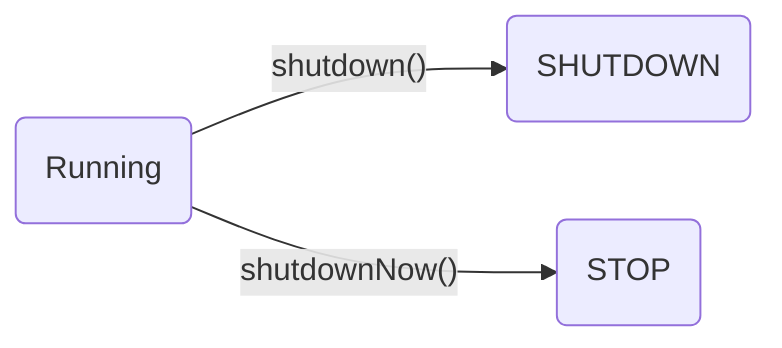

# 序言

为什么需要线程池？

在实际使用中，线程是很占用系统资源的，如果对线程管理不善很容易导致系统问题。 
因此，在大多数并发框架中都会使用线程池来管理线程，使用线程池管理线程主要有如下好处：
1. 使用线程池可以重复利用已有的线程继续执行任务，避免线程在创建和销毁时造成的消耗。
2. 由于没有线程创建和销毁时的消耗，可以提高系统响应速度。
3. 通过线程可以对线程进行合理的管理，根据系统的承受能力调整可运行线程数量的大小等。

# 工作原理

线程池执行所提交的任务过程：
1. 先判断线程池中核心线程池所有的线程是否都在执行任务。如果不是，则新创建一个线程执行刚提交的任务，否则，核心线程池中所有的线程都在执行任务，则进入第2步；
2. 判断当前阻塞队列是否已满，如果未满，则将提交的任务放置在阻塞队列中；否则，则进入第3步；
3. 判断线程池中所有的线程是否都在执行任务，如果没有，则创建一个新的线程来执行任务，否则，则交给饱和策略进行处理

# 线程池的分类

newCachedThreadPool

无限大小，短期

FixedThreadPool

固定大小

SingleThreadExecutor

newCachedThreadPool

创建一个可根据需要创建新线程的线程池，但是在以前构造的线程可用时将重用它们，并在需要时使用提供的 ThreadFactory 创建新线程特征：（1）线程池中数量没有固定，可达到最大值（Interger. MAX_VALUE） （2）线程池中的线程可进行缓存重复利用和回收（回收默认时间为1分钟） （3）当线程池中，没有可用线程，会重新创建一个线程

newFixedThreadPool

创建一个可重用固定线程数的线程池，以共享的无界队列方式来运行这些线程。在任意点，在大多数 nThreads 线程会处于处理任务的活动状态。如果在所有线程处于活动状态时提交附加任务，则在有可用线程之前，附加任务将在队列中等待。如果在关闭前的执行期间由于失败而导致任何线程终止，那么一个新线程将代替它执行后续的任务（如果需要）。在某个线程被显式地关闭之前，池中的线程将一直存在。特征：（1）线程池中的线程处于一定的量，可以很好的控制线程的并发量 （2）线程可以重复被使用，在显示关闭之前，都将一直存在 （3）超出一定量的线程被提交时候需在队列中等待

newSingleThreadExecutor

创建一个使用单个 worker 线程的 Executor，以无界队列方式来运行该线程。（注意，如果因为在关闭前的执行期间出现失败而终止了此单个线程，那么如果需要，一个新线程将代替它执行后续的任务）。可保证顺序地执行各个任务，并且在任意给定的时间不会有多个线程是活动的。与其他等效的 newFixedThreadPool(1) 不同，可保证无需重新配置此方法所返回的执行程序即可使用其他的线程。特征： （1）线程池中最多执行1个线程，之后提交的线程活动将会排在队列中以此执行

newSingleThreadScheduledExecutor
创建一个单线程执行程序，它可安排在给定延迟后运行命令或者定期地执行。特征： （1）线程池中最多执行1个线程，之后提交的线程活动将会排在队列中以此执行 （2）可定时或者延迟执行线程活动

newScheduledThreadPool

创建一个线程池，它可安排在给定延迟后运行命令或者定期地执行。特征： （1）线程池中具有指定数量的线程，即便是空线程也将保留 （2）可定时或者延迟执行线程活动

newWorkStealingPool

创建一个带并行级别的线程池，并行级别决定了同一时刻最多有多少个线程在执行，如不传如并行级别参数，将默认为当前系统的CPU个数

线程池的生命周期
线程池的生命周期

B1 ----> C[(TIDYING)]
B2 ----> C
C ----> D[(TERMINATED)]

线程池的生命周期
.RUNNING ：能接受新提交的任务，并且也能处理阻塞队列中的任务；
.SHUTDOWN：关闭状态，不再接受新提交的任务，但却可以继续处理阻塞队列中已保存的任务。
.STOP：不能接受新任务，也不处理队列中的任务，会中断正在处理任务的线程。
.TIDYING：如果所有的任务都已终止了，workerCount (有效线程数) 为0，线程池进入该状态后会调用terminated() 方法进入TERMINATED 状态。
.TERMINATED：在terminated() 方法执行完后进入该状态，默认terminated()方法中什么也没有做。

线程池只有两种状态： running 和 terminated ，在这两个状态之间有三种过渡状态

线程池的创建
注意：一定要掌握各个参数的具体含义

参数说明
.corePoolSize：核心线程池的大小
.maximumPoolSize：线程池能创建线程的最大个数
.keepAliveTime：空闲线程存活时间
.unit：时间单位，为keepAliveTime指定时间单位
.workQueue：阻塞队列，用于保存任务的阻塞队列
.threadFactory：创建线程的工程类
.handler：饱和策略（拒绝策略）

阻塞队列
.ArrayBlockingQueue

       基于数组的阻塞队列实现，在ArrayBlockingQueue内部，维护了一个定长数组，以便缓存队列中的数据对象，这是一个常用的阻塞队列，除了一个定长数组外，ArrayBlockingQueue内部还保存着两个整形变量，分别标识着队列的头部和尾部在数组中的位置。　　ArrayBlockingQueue在生产者放入数据和消费者获取数据，都是共用同一个锁对象，由此也意味着两者无法真正并行运行，这点尤其不同于LinkedBlockingQueue；按照实现原理来分析，ArrayBlockingQueue完全可以采用分离锁，从而实现生产者和消费者操作的完全并行运行。Doug Lea之所以没这样去做，也许是因为ArrayBlockingQueue的数据写入和获取操作已经足够轻巧，以至于引入独立的锁机制，除了给代码带来额外的复杂性外，其在性能上完全占不到任何便宜。 ArrayBlockingQueue和LinkedBlockingQueue间还有一个明显的不同之处在于，前者在插入或删除元素时不会产生或销毁任何额外的对象实例，而后者则会生成一个额外的Node对象。这在长时间内需要高效并发地处理大批量数据的系统中，其对于GC的影响还是存在一定的区别。而在创建ArrayBlockingQueue时，我们还可以控制对象的内部锁是否采用公平锁，默认采用非公平锁。

.LinkedBlockingQueue

       基于链表的阻塞队列，同ArrayListBlockingQueue类似，其内部也维持着一个数据缓冲队列（该队列由一个链表构成），当生产者往队列中放入一个数据时，队列会从生产者手中获取数据，并缓存在队列内部，而生产者立即返回；只有当队列缓冲区达到最大值缓存容量时（LinkedBlockingQueue可以通过构造函数指定该值），才会阻塞生产者队列，直到消费者从队列中消费掉一份数据，生产者线程会被唤醒，反之对于消费者这端的处理也基于同样的原理。而LinkedBlockingQueue之所以能够高效的处理并发数据，还因为其对于生产者端和消费者端分别采用了独立的锁来控制数据同步，这也意味着在高并发的情况下生产者和消费者可以并行地操作队列中的数据，以此来提高整个队列的并发性能。

.DelayQueue

　　DelayQueue中的元素只有当其指定的延迟时间到了，才能够从队列中获取到该元素。DelayQueue是一个没有大小限制的队列，因此往队列中插入数据的操作（生产者）永远不会被阻塞，而只有获取数据的操作（消费者）才会被阻塞。　　使用场景：　　DelayQueue使用场景较少，但都相当巧妙，常见的例子比如使用一个DelayQueue来管理一个超时未响应的连接队列。

.PriorityBlockingQueue

　 基于优先级的阻塞队列（优先级的判断通过构造函数传入的Compator对象来决定），但需要注意的是PriorityBlockingQueue并不会阻塞数据生产者，而只会在没有可消费的数据时，阻塞数据的消费者。因此使用的时候要特别注意，生产者生产数据的速度绝对不能快于消费者消费数据的速度，否则时间一长，会最终耗尽所有的可用堆内存空间。在实现PriorityBlockingQueue时，内部控制线程同步的锁采用的是公平锁。

.SynchronousQueue

       一种无缓冲的等待队列，类似于无中介的直接交易，有点像原始社会中的生产者和消费者，生产者拿着产品去集市销售给产品的最终消费者，而消费者必须亲自去集市找到所要商品的直接生产者，如果一方没有找到合适的目标，那么对不起，大家都在集市等待。相对于有缓冲的BlockingQueue来说，少了一个中间经销商的环节（缓冲区），如果有经销商，生产者直接把产品批发给经销商，而无需在意经销商最终会将这些产品卖给那些消费者，由于经销商可以库存一部分商品，因此相对于直接交易模式，总体来说采用中间经销商的模式会吞吐量高一些（可以批量买卖）；但另一方面，又因为经销商的引入，使得产品从生产者到消费者中间增加了额外的交易环节，单个产品的及时响应性能可能会降低。　　声明一个SynchronousQueue有两种不同的方式，它们之间有着不太一样的行为。公平模式和非公平模式的区别:　　如果采用公平模式：SynchronousQueue会采用公平锁，并配合一个FIFO队列来阻塞多余的生产者和消费者，从而体系整体的公平策略；　　但如果是非公平模式（SynchronousQueue默认）：SynchronousQueue采用非公平锁，同时配合一个LIFO队列来管理多余的生产者和消费者，而后一种模式，如果生产者和消费者的处理速度有差距，则很容易出现饥渴的情况，即可能有某些生产者或者是消费者的数据永远都得不到处理。

arrayblockingqueue和linkedblockqueue的区别：1. 队列中锁的实现不同    ArrayBlockingQueue实现的队列中的锁是没有分离的，即生产和消费用的是同一个锁；    LinkedBlockingQueue实现的队列中的锁是分离的，即生产用的是putLock，消费是takeLock2. 队列大小初始化方式不同    ArrayBlockingQueue实现的队列中必须指定队列的大小；    LinkedBlockingQueue实现的队列中可以不指定队列的大小，但是默认是Integer.MAX_VALUE 

拒绝策略
.ThreadPoolExecutor.AbortPolicy:丢弃任务并抛出RejectedExecutionException异常。
.ThreadPoolExecutor.DiscardPolicy：也是丢弃任务，但是不抛出异常。
.ThreadPoolExecutor.DiscardOldestPolicy：丢弃队列最前面的任务，然后重新尝试执行任务（重复此过程）
.ThreadPoolExecutor.CallerRunsPolicy：由调用线程处理该任务

execute方法执行逻辑

execute方法执行逻辑
.如果当前运行的线程少于corePoolSize，则会创建新的线程来执行新的任务；
.如果运行的线程个数等于或者大于corePoolSize，则会将提交的任务存放到阻塞队列workQueue中；
.如果当前workQueue队列已满的话，则会创建新的线程来执行任务；
.如果线程个数已经超过了maximumPoolSize，则会使用饱和策略RejectedExecutionHandler来进行处理。

Executor和Submit
.submit是基方法Executor.execute(Runnable)的延伸，通过创建并返回一个Future类对象可用于取消执行和/或等待完成。

线程池的关闭
.关闭线程池，可以通过shutdown和shutdownNow两个方法
.原理：遍历线程池中的所有线程，然后依次中断
.1、shutdownNow首先将线程池的状态设置为STOP,然后尝试停止所有的正在执行和未执行任务的线程，并返回等待执行任务的列表；
.2、shutdown只是将线程池的状态设置为SHUTDOWN状态，然后中断所有没有正在执行任务的线程

启动线程的方式：
1. Thread
2. Runnable
3. Lambda 表达式
4. Executors.newCachedThread