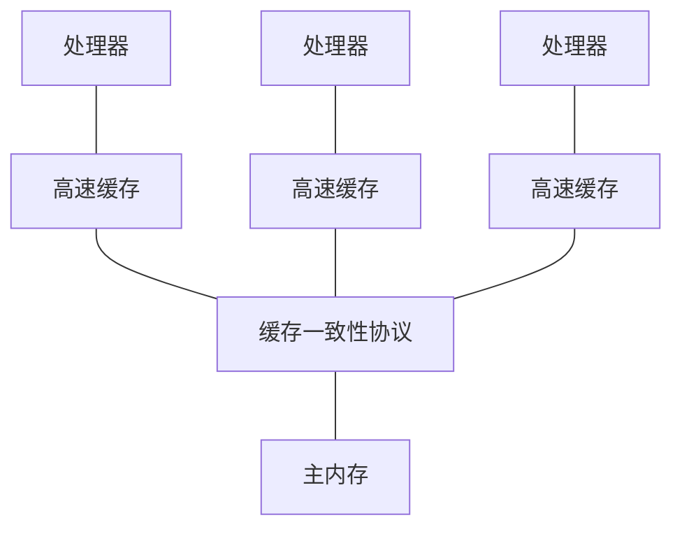
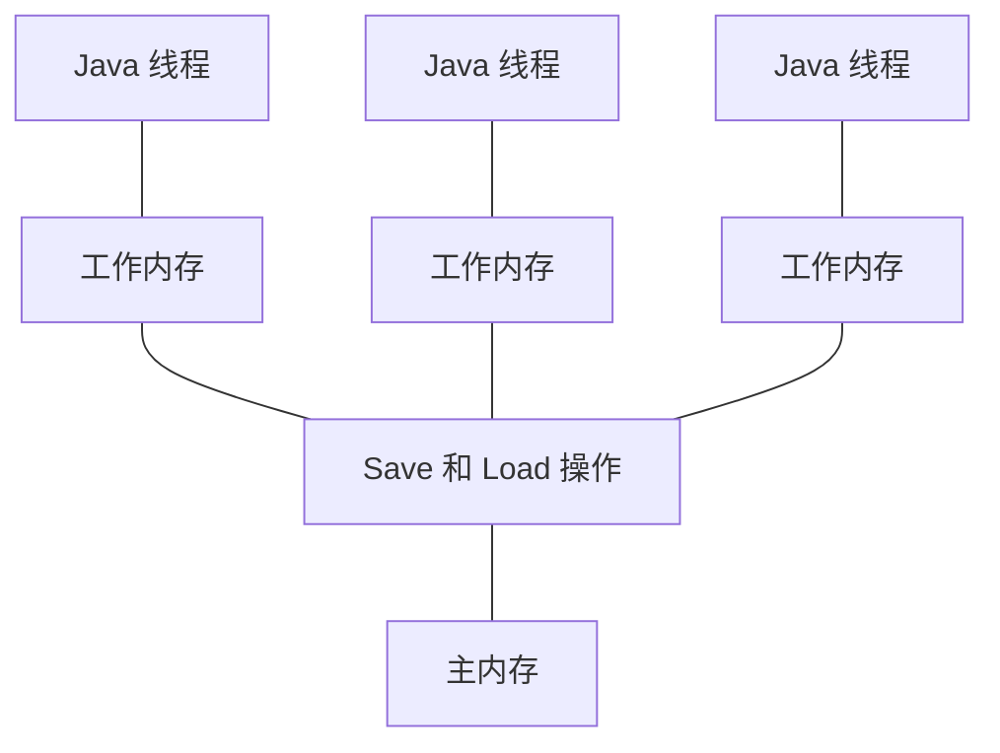

Java 多线程与高并发之—— volatile 关键字

# 序言
在定义某个类的成员变量时，我们可以使用 **volatile** 关键字来修饰该变量。

这个关键字在平时用不到，只有在**多线程**时才会用到。

它的作用有两个：
1. 保证线程可见性
2. 禁止指令重排

# 保证线程可见性
## 现代计算机的内存模型
首先要了解的是现代计算机的内存模型


在计算机的早期时代，因为 CPU 的运行速度和内存的读写速度**相差无几**。<br>
所以当时是没有高速缓存的。<br>
CPU 直接从内存读取数据，进行计算，返回结果给内存。

但随着技术的发展，CPU 的速度越来越快，但是内存读写速度的发展却陷入了瓶颈。<br>
两者之间出现了**几个数量级**的差距。

于是不得不加入了读写速度能够与 CPU 匹配的**高速缓存**：<br>
将运算需要使用到的数据复制到缓存中，让运算能快速进行。<br>
当运算结束后再将数据从缓存同步回内存之中，这样处理器就无须等待缓慢的内存读写了。

但此时又有了新的问题：<br>
假如多个处理器从内存中取走了同一份数据，再经过各自的计算后，哪份数据才是真正需要写回内存的哪份？

于是提出了**缓存一致性协议**，用于**同步**多个缓存之间的数据。

## JMM
根据现代计算机的内存模型，Java 也提出了相似的内存模型（简称 JMM—— Java Memory Model）。



Java 内存模型规定了以下几点：
1. 所有的变量都存储在**主内存**中。
2. 每条线程都有自己的**工作内存**，保存了主内存中的数据**拷贝**。
3. 线程对变量的所有操作（读取、赋值）都必须在**工作内存**中进行，而不能直接读写主内存中的变量。
4. 线程间传递变量值需要在**主内存**中完成。

## 线程可见性
当线程修改了其工作内存的数据后，需要使得其他线程能够看到该数据，这就是**线程可见性**。

在一般情况下，线程间是不可见的。

需要通过某些方法，强制触发该读写流程：
- 写：
	- 改变工作内存中拷贝副本的值。
	- 将改变后的副本同步回主内存。
- 读：
	- 从主内存中拷贝最新的变量到副本中。
	- 读取工作内存中副本的值。


请注意：<br>
volatile 不是实现线程可见性的唯一方法。<br>
只要能够触发该流程，就能实现线程间可见。

### 案例
现有一个小程序
```java
public class T01_VolatileTest {
    boolean running = true; //对比一下有无volatile的情况下，整个程序运行结果的区别
    void m() {
        System.out.println("m start");
        while(running) {
        }
        System.out.println("m end!");
    }

    public static void main(String[] args) throws InterruptedException {
        T01_VolatileTest t = new T01_VolatileTest();
        new Thread(t::m, "t1").start();

        //睡眠一段时间是为了让线程 t 将 running = true 复制到工作内存中
        Thread.sleep(1000);

        t.running = false;
    }
}
```
该程序很简单。<br>
启动一个线程，当 `running = false` 时死循环，当 `running = ture` 时结束线程。

结果
```java
m start
```
并且该程序不会结束，一直处于运行状态。<br>
说明程序陷入了死循环。

这就是**线程间不可见**：<br>
线程 t 一开始从主内存中复制的变量是 `running = true`。<br>
主线程先等待 1s，确保线程 t 复制的是 `running = true` 。<br>
然后将 `running` 改为 `false`。<br>
但是线程 t 中的 `running` 并没有修改，所以线程 t 陷入了死循环。

### 解决办法
#### volatile 关键字
使用 volatile 关键字修饰共享变量
```java
public class T01_VolatileTest {
    volatile boolean running = true; //对比一下有无volatile的情况下，整个程序运行结果的区别
    void m() {
        System.out.println("m start");
        while(running) {
        }
        System.out.println("m end!");
    }

    public static void main(String[] args) throws InterruptedException {
        T01_VolatileTest t = new T01_VolatileTest();
        new Thread(t::m, "t1").start();

        //睡眠一段时间是为了让线程 t 将 running = true 复制到工作内存中
        Thread.sleep(1000);

		//修改 running 的值，尝试让线程 t 停下来
        t.running = false;
    }
}
```
结果
```java
m start
m end!
```

#### synchronized 关键字
synchronized 关键字也是能够保证线程可见性的。

```java
public class T01_VolatileTest {
    boolean running = true; //对比一下有无volatile的情况下，整个程序运行结果的区别
    void m() {
        System.out.println("m start");
        while(running){
			synchronized(this){
			}
        }
        System.out.println("m end!");
    }

    public static void main(String[] args) throws InterruptedException {
        T01_VolatileTest t = new T01_VolatileTest();
        new Thread(t::m, "t1").start();

        //睡眠一段时间是为了让线程 t 将 running = true 复制到工作内存中
        Thread.sleep(1000);

		//修改 running 的值，尝试让线程 t 停下来
        t.running = false;
    }
}
```
结果
```java
m start
m end!
```

#### Thread.sleep() 
如果调用了 Thread.sleep() 方法，那么 JVM 会利用线程睡眠的这段时间进行数据的同步。
```java
public class T01_VolatileTest {
    boolean running = true; //对比一下有无volatile的情况下，整个程序运行结果的区别
    void m() {
        System.out.println("m start");
        while(running) {
            try {
                Thread.sleep(1);
            } catch (InterruptedException e) {
                e.printStackTrace();
            }
        }
        System.out.println("m end!");
    }

    public static void main(String[] args) throws InterruptedException {
        T01_VolatileTest t = new T01_VolatileTest();
        new Thread(t::m, "t1").start();

        //睡眠一段时间是为了让线程 t 将 running = true 复制到工作内存中
        Thread.sleep(1000);

		//修改 running 的值，尝试让线程 t 停下来
        t.running = false;
    }
}
```
结果
```java
m start
m end!
```

#### System.out.println()
如果线程调用了 System.out.println() 方法，**无论输出的是什么**，JVM 都会进行数据同步。
```java
public class T01_VolatileTest {
    boolean running = true; //对比一下有无volatile的情况下，整个程序运行结果的区别
    void m() {
        System.out.println("m start");
        while(running) {
			System.out.println("666");
        }
        System.out.println("m end!");
    }

    public static void main(String[] args) throws InterruptedException {
        T01_VolatileTest t = new T01_VolatileTest();
        new Thread(t::m, "t1").start();

        //睡眠一段时间是为了让线程 t 将 running = true 复制到工作内存中
        Thread.sleep(1000);

		//修改 running 的值，尝试让线程 t 停下来
        t.running = false;
    }
}
```
结果
```java
m start
666
……（省略 10000 个 666）
666
m end!
```

#### 总结
要实现线程间可见很简单，只要强制性地让 JVM 实现数据的同步就可以了。<br>
方法有很多，笔者找到了这四种，但应该还有很多方法能触发线程间可见。

# 禁用指令重排
在单例模式中，**双检锁**（DCL—— Double Check Lock）式的单例模式必须使用 **volatile** 关键字。

双检锁式单例模式
```java
public class Mgr06 {
	//使用volatile关键字，防止JVM内部语句重排后，没有初始化就返回INSTANCE
    private static volatile Mgr06 INSTANCE;

    private Mgr06(){}

    public static Mgr06 getInstance() {
        if(INSTANCE == null){
            //双重检查
            synchronized (Mgr06.class){
                if(INSTANCE == null){
                   INSTANCE = new Mgr06();
                }
            }
        }
        return INSTANCE;
    }
}
```

指令重排：<br>
`INSTANCE = new Mgr06();` 在 Java 中是一句话，但是翻译成汇编语言会变成三条语句：
1. 申请内存
2. 初始化成员变量
3. 让 INSTANCE 指向这块内存

为了提高性能，系统会对指令进行重排序。

所以有时会把指令重排为以下顺序：
1. 申请内存
2. 让 INSTANCE 指向这块内存
3. 初始化成员变量

即第二条指令和第三条指令**互换**。

然后考虑一个非常非常神奇的巧合：
1. 线程 1 访问该单例，发现没有创建单例，于是在该线程中，执行**创建单例**的操作。
2. 系统将 `INSTANCE = new Mgr06();` 的**指令重排**了。<br>
	于是线程 1 先申请了内存，将 INSTANCE 指向了该内存。
3. 在线程 1 初始化成员变量**前**，线程切换了，切换的线程 2 也要使用该单例模式。
4. 线程 2 发现 `INSTANCE` 不是 `null` ，因为它已经指向了某块内存。<br>
		于是线程 2 开始直接使用 `INSTANCE` 。
5. 但 `INSTANCE` 的成员变量没有初始化，此时它们都是默认值（例如 int 类型的变量默认值是 0 ）。<br>
			所以线程 2 使用 `INSTANCE` 执行了一系列奇奇怪怪的操作，程序出错。
			
这是一个极难复现的 BUG，要在**百万级别**的并发下才会偶尔出现。<br>
			
# volatile 与引用类型的二三事
笔者在写这篇博文的时候，看到了网上有很多人写了这样一句话：
> volatile 修饰引用类型时，只能保证引用类型本身是线程间可见的，但是其内部字段是线程间不可见。

换句话说，如果我有一个被 **volatile** 修饰的引用类型的变量（数组或对象）。<br>
如果我把这个变量本身（即地址）改变了，这个改变是线程间**可见**的。<br>
如果我把这个变量内部的值改变了（数组的内容，对象的成员变量），这个改变是线程间**不可见**的。

但是笔者仔细研究后发现，这句话并不完全正确。

## 线程的工作内存到底存了什么东西

首先，提个问题：线程的工作内存中，到底存了什么？

1. 假设一：<br>
	存的是引用类型本身（即地址）。<br>
	但是如果存的是地址，说明我要访问该引用类型的内部字段都必须去主内存中找，为什么会出现内部字段线程间不可见呢？
2. 假设二：<br>
	存的是引用类型的所有内容（包含内部字段）。<br>
	如果是这样的话，我现在有一个很大的对象（假设为 20 MB）。<br>
	有 1000 个线程在同时访问这个对象，那么每个线程都需要花 20MB 来存储这个对象。<br>
	总和就是 20GB ，这可能吗？
	
无论哪种假设，都不合理。

最终笔者在《深入理解Java虚拟机（第二版）》中找到了答案：
> 线程的工作内存中拷贝了对象的引用，和对象中正在访问的字段，对象中其他没有访问到的字段不会拷贝。

既然是**正在访问**的字段，这也就说明当一段时间不访问该字段后，其拷贝会从线程的工作内存中删除。<br>
这很好理解：如果线程遍历了主内存中的数组，其内部字段的拷贝肯定是用过后就删除的，否则会严重占用内存。

----------


测试 1 ：数组
```java
public class T02_VolatileReference1 {
    boolean[] running = new boolean[]{true};

    void m() {
        System.out.println("m start");
        while (running[0]) {
        }
        System.out.println("m end!");
    }

    public static void main(String[] args) throws InterruptedException {
        T02_VolatileReference1 t = new T02_VolatileReference1();
        new Thread(t::m, "t1").start();
        Thread.sleep(1000);
        t.running[0] = false;
    }
}
```
该程序很简单，`running` 是一个引用类型，是一个 boolean 型的数组。<br>
`running[0]` 的初始值是 `false`，所以线程 t 在启动后会死循环。<br>
隔 1000ms 后，在主线程中修改线程 t 的 `running[0]` 为 `false`。<br>
查看线程 t 是否会结束死循环。

结果：死循环
```java
m start
```

测试 2：对象
```java
public class T03_VolatileReference2 {
    Test test = new Test();

    static class Test {
        boolean running = true;
    }

    void m(){
        System.out.println("m start");
        while(test.running){
        }
        System.out.println("m end");
    }

    public static void main(String[] args) throws InterruptedException {
        T03_VolatileReference2 t = new T03_VolatileReference2();
        new Thread(t::m).start();
        Thread.sleep(1000);
        t.test.running=false;
    }
}
```
结果：死循环
```java
m start
```

结论：<br>
线程的工作内存会拷贝对象的正在访问的字段。


## volatile 修饰的引用类型
volatile 的工作原理是什么？

通俗来讲：<br>
volatile 变量在每次被线程访问时，都强迫从主内存中**重读**该变量的值。<br>
而当该变量发生变化时，又会强迫线程将最新的值**刷新**到主内存。
这样任何时刻，不同的线程总能看到该变量的最新值。

线程**写** volatile 变量的过程：
1. 改变线程工作内存中 volatile 变量副本的值。
2. 将改变后的副本从工作内存刷新到主内存。

线程**读** volatile 变量过程：
1. 从主内存读取volatile变量的最新值到线程工作内存中。
2. 从工作内存读取volatile变量的副本。

那么 volatile 修饰的引用类型变量的内部字段的读写过程是什么样的呢？


----------

volatile 修饰数组

```java
public class T02_VolatileReference1 {
    volatile boolean[] running = new boolean[]{true};

    void m() {
        System.out.println("m start");
        while (running[0]) {
        }
        System.out.println("m end!");
    }

    public static void main(String[] args) throws InterruptedException {
        T02_VolatileReference1 t = new T02_VolatileReference1();
        new Thread(t::m, "t1").start();
        Thread.sleep(1000);
        t.running[0] = false;
    }
}
```
结果
```java
m start
m end!
```

这说明 volatile 修饰的数组其内部字段是线程间**可见**的！


----------

那么网上流传的 volatile 修饰的引用类型内部字段线程间**不可见**的说法是哪来的呢？

请看以下代码：
```java
public class T02_VolatileReference1 {
    volatile boolean[] running = new boolean[]{true};

    void m() {
        System.out.println("m start");
        boolean[] running2 = running;
        while (running2[0]) {
        }
        System.out.println("m end!");
    }

    public static void main(String[] args) throws InterruptedException {
        T02_VolatileReference1 t = new T02_VolatileReference1();
        new Thread(t::m, "t1").start();
        Thread.sleep(1000);

        t.running[0] = false;
    }
}
```
我们创建一个 running2 ，它与 running 是**相同**的，但是没有被 **volatile** 修饰。

结果：死循环
```java
m start
```


----------

结合以上 volatile 的工作原理和测试，我们可以得到以下结论：<br>
volatile 像一个标志，告诉我们的程序，看到这个标志，必须去**主内存**中读写。<br>
所以当使用 volatile 修饰引用类型时，程序依然会去主内存中读写，所以内部字段是线程间**可见**的。<br>

重点是在读的时候，也必须通过被 **volatile** 修饰的引用类型去读，而不能使用非 volatile 引用类型去读。<br>
就像我们的测试：
```java
volatile boolean[] running = new boolean[]{true};
```
被 volatile 修饰的是 `running` ，所以读写时都应该用 `running`。
```java
boolean[] running2 = running;
```
而 `running2` 不是被 `volatile` 修饰的，尽管 `running2` 和 `running` 本身的值是一样的。<br>
但是使用 `running2` 读写内部字段就是线程间**不可见**的。


# volatile 不能保证原子性
volatile 实现了线程可见性，使得多线程的数据能够同步，但是它并不能保证原子性。

什么是原子性？<br>
简单来说：保证指令序列是一体的，要么全部执行，要么全部不执行，不会发生执行到一半被打断的情况。

在 Java 中，使用 synchronized 关键字实现锁机制来保证原子性。

测试：
```java
public class T04_VolatileNotSync {
    volatile int count = 0;

    void m() {
        for (int i = 0; i < 10000; i++) {
			count++;
		}
    }

    public static void main(String[] args) throws InterruptedException {
        T04_VolatileNotSync t = new T04_VolatileNotSync();

        for (int i = 0; i < 10; i++) {
            new Thread(t::m).start();
        }

        //等待线程结束
        Thread.sleep(3000);

        System.out.println(t.count);
    }
}
```
该程序的目的是创建 10 个线程，每个线程在 count 上执行 10000 次 ++ 操作<br>
预期输出是 count = 100000<br>
在没有锁的情况下，实际输出是多少？

结果
```java
26930
```
该结果不是个例，笔者测试过很多次，结果基本不会超过 30000 。

这是为什么？

因为 volatile 关键字不能保证原子性。

假设某一时刻 count = 10 ，共有两个线程

| 时刻 | Thread 1 | Thread 2 |
| :-- | :-- | :-- |
| T1 | 读取到 count = 10 | 等待 CPU |
| T2 | 让出 CPU | 获得 CPU ，开始执行操作。<br>读取到 count = 10 |
| T3 | 等待CPU | 将 count = 11 写回 内存 |
| T4 | 获得 CPU ，继续执行操作。<br>将 count = 11 写回内存 | 等待操作 |

可以看到，一共执行了两次自增操作，但写回内存的结果却只有一次。

在程序执行过程中发生的数据冲突不只这一种，但是导致的结果是一样的：**数据不安全**。

如果要保证数据安全，需要使用 synchronized 关键字。
```java
public class T05_VolatileVsSync {
    int count = 0;

    synchronized void m() {
		for (int i = 0; i < 10000; i++){
			count++;
		}
    }

    public static void main(String[] args) throws InterruptedException {
        T05_VolatileVsSync t = new T05_VolatileVsSync();

        for (int i = 0; i < 10; i++) {
            new Thread(t::m).start();
        }

        //等待线程结束
        Thread.sleep(3000);

        System.out.println(t.count);
    }
}
```
结果
```java
100000
```

# 源码链接
该文章源码链接 [Github](https://github.com/kekaiyuan/javaquestion/tree/main/juc/src/com/kky/volatiletest)