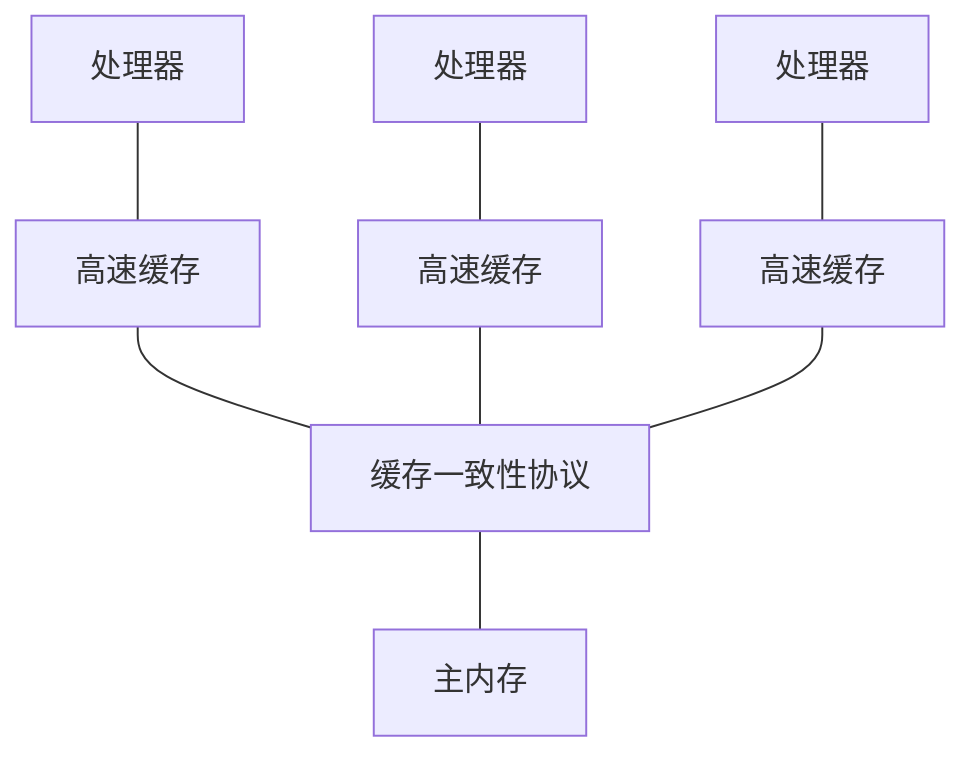
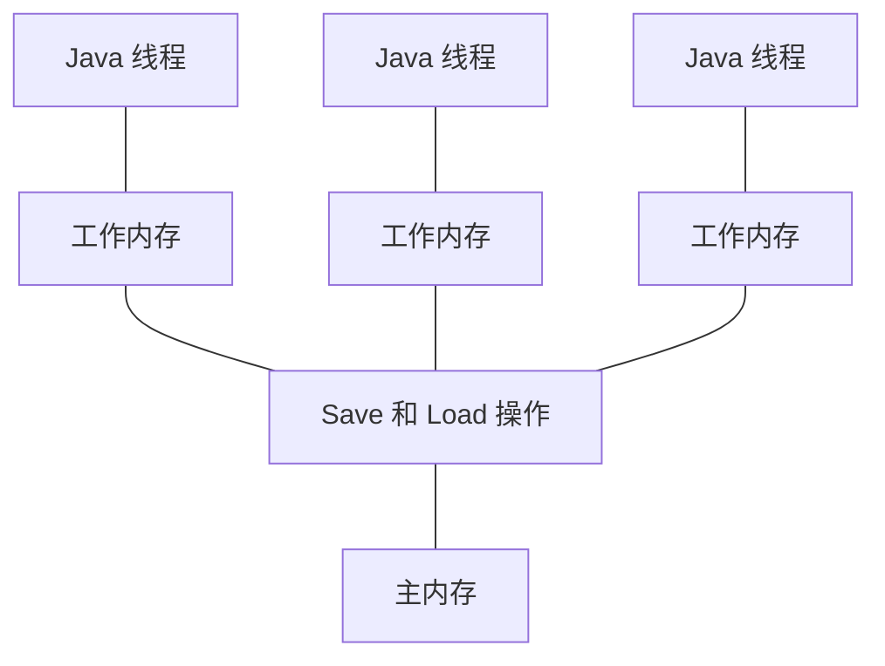

Java 多线程与高并发之—— volatile 关键字

# 序言
在定义某个类的成员变量时，我们可以使用 **volatile** 关键字来修饰该变量。

这个关键字在平时见不到，只有在多线程编程时才会用到。

它的作用有两个：
1. 保证线程可见性
2. 禁止指令重排

# 保证线程可见性
## 现代计算机的内存模型
首先要了解的是现代计算机的内存模型


在计算机的早期时代，因为 CPU 的运行速度和内存的读写速度相差无几。<br>
所以当时是没有高速缓存的。<br>
CPU 直接从内存读取数据，进行计算，返回结果给内存。

但随着技术的发展，CPU 的速度越来越快，但是内存读写速度的发展却陷入了瓶颈。<br>
两者之间出现了几个数量级的差距。

于是不得不加入了读写速度能够与 CPU 匹配的高速缓存：<br>
将运算需要使用到的数据复制到缓存中，让运算能快速进行。
当运算结束后再从缓存同步回内存之中，这样处理器就无须等待缓慢的内存读写了。

但此时又有了新的问题：<br>
假如多个处理器从内存中取走了同一份数据，再经过各自的计算后，哪份数据才是真正需要写回内存的哪份？

于是提出了**缓存一致性协议**，用于同步多个缓存之间的数据。

## JMM
根据现代计算机的内存模型，Java 也提出了相似的内存模型（简称 JMM—— Java Memory Model）。



Java 内存模型规定了以下几点：
1. 所有的变量都存储在主内存中。
2. 每条线程都有自己的工作内存，保存了主内存中的数据拷贝。
3. 线程对变量的所有操作（读取、赋值）都必须在工作内存中进行，而不能直接读写主内存中的变量。
4. 线程间传递变量值需要在主内存中完成。

## 线程可见性
当线程修改了其工作内存的数据后，需要使得其他线程能够看到该数据，这就是线程可见性。

在一般情况下，线程间是不可见的。

需要通过某些方法，强制触发该流程：
1. 线程 1 将工作内存的数据同步回内存。
2. 触发缓存一致性协议，将内存中的数据同步到其他线程的工作内存。
3. 请注意：

	volatile 不是实现线程可见性的唯一方法。
	只要能够触发该流程，就能实现线程间可见。
	
## 案例
现有一个小程序
```java?linenums
public class T01_VolatileTest {
    boolean running = true; //对比一下有无volatile的情况下，整个程序运行结果的区别
    void m() {
        System.out.println("m start");
        while(running) {
        }
        System.out.println("m end!");
    }

    public static void main(String[] args) throws InterruptedException {
        T01_VolatileTest t = new T01_VolatileTest();
        new Thread(t::m, "t1").start();

        //睡眠一段时间是为了让线程 t 将 running = true 复制到工作内存中
        Thread.sleep(10);

        t.running = false;
    }
}
```


保证线程可见性
MESI
缓存一致性协议

禁止指令重排序
流水线技术
DCL单例 double check lock
loadfence原语
storefence原语

INSTANCE = new Mgr06();
分三步：
1. 申请内存

	此时的成员变量都是默认值
2. 初始化成员变量（堆中）
3. INSTANCE （在栈中） 指向堆的地址

2，3换顺序
先指向，再赋值

第一个线程new一半，此时已经指向了，不是空值
第二个线程切进来拿去用


CAS 无锁优化 自旋

Compare And Set
cas（V）

ABA
版本号

## 源码链接
该文章源码链接 [Github](url)