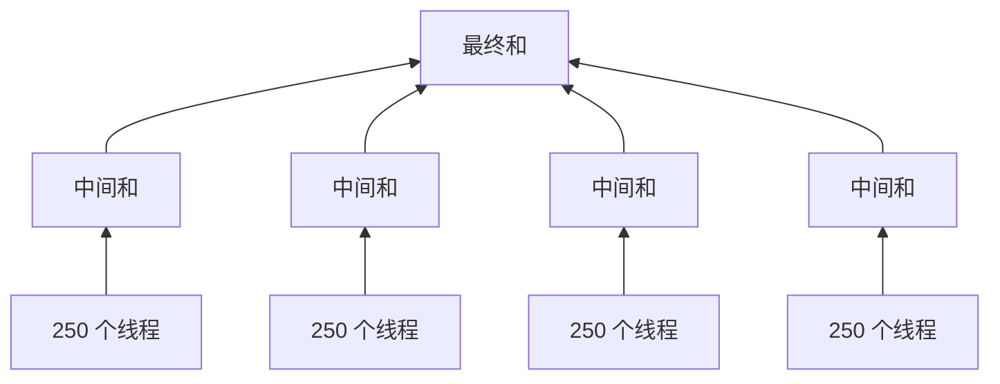

CAS 无锁优化 自旋

Compare And Set
cas（V）

ABA
版本号

# 三种方式实现递增

automic 比 synchronized 快：无锁
LongAdder 比 automic 快：分段锁

LongAdder 在线程数特别高的情况下有优势。

```mermaid!
graph BT;
A1[250 个线程] --> B1[中间和]
A2[250 个线程] --> B2[中间和]
A3[250 个线程] --> B3[中间和]
A4[250 个线程] --> B4[中间和]
B1 --> C1[最终和]
B2 --> C1
B3 --> C1
B4 --> C1
```

## 源码链接
该文章源码链接 [Github]()