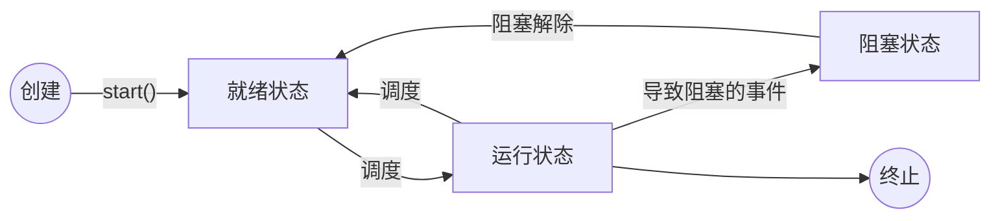

Java 学习笔记之 10 —— 线程
 
# 序言
什么是线程？

这个概念很复杂，需要牵扯到操作系统的许多知识。

但如果问线程有什么用？

这个问题很简单。

线程用于**并行执行进程**。


----------


首先，

 

 
 
本章概述 
.线程基础内容 
–程序、进程与线程 
–线程的创建和启动 
–线程的生命周期 
.线程同步 
–线程同步的必要性 
–线程同步的实现 
–死锁 
.线程间通信 
–线程间通信的必要性 
–线程间通信的实现  

 
 
 
# 概念
- 程序 Program
	
	是一个指令的集合，是静态的。
	
- 进程 Process

	（正在执行中的程序）是一个动态的概念 。
	- 进程是程序的一次静态态执行过程，占用特定的地址空间。
	- 每个进程都是独立的，由 3 部分组成 cpu , data , code 。
	- 缺点：
		- 浪费内存
		- 增加 CPU 的负担

- 线程 Thread

	是进程中一个“单一的连续控制流程”  (a single sThread,equential flow of control)/执行路径 。
	- 线程又被称为轻量级进程（lightweight process）。  
	- 一个进程可拥有多个线程，宏观上并行，微观上交替执行。它们之间相互独立。
	- 一个进程中的线程可以共享相同的内存单元/内存地址空间。<br>
		——> 可以访问相同的变量和对象。<br>
		——> 线程们从

.线程:是进程中一个“单一的连续控制流程”  (a single sThread,equential flow of control)/执行路径 
.线程又被称为轻量级进程(lightweight process)。  
.Threads run at the same time, independently of one another  
.一个进程可拥有多个并行的(concurrent)线程 
.一个进程中的线程共享相同的内存单元/内存地址空间.可以访问相同的变量和对象，而且它们从同一堆中分配对象.通信、数据交换、同步操作 
.由于线程间的通信是在同一地址空间上进行的，所以不需要额外的通信机制，这就使得通信更简便而且信息传递的速度也更快。 

例：
程序员所写的代码，是程序，是静态的。

一个程序对应多个进程。<br>
例如：一台电脑可以登录多个QQ。<br>
它们的代码是一样的，只不过执行后，人为地输入了不同的账号密码。

当程序运行起来后，就变成了进程，是动态的。

一台电脑可以运行多个程序，即存在多个进程。<br>
这些进程是交替执行的，只是因为切换的速度很快，所以很像是同时运行的。<br>

而进程内部又可以划分为一个个线程。
 
进程是申请资源的最小单位 
 
 
进程不线程 
.一个进程中至少有一个线程  

 
 核
 
 
Javac不java 
 
public class ThreadDemo01 { 
     public static void main(String[] args) {  
             for(int i=0;i<100000;i++){ 
      System.out.println("hello"); 
             } 
     } 
} 
（编译javac）.启动了java的编译器,javac 就是一个进程, 
编译结束后，进行结束，消失 
 
执行(java).启动java虚拟机   java运行进程 
 

 
 
 
 
Javac与Java 
.Java虚拟机启动的时候会有一个进程java.exe,该进程中至少有一个线程，在负责java程序的执行。而且这个线程运行的代码存在于main方法中,该线程称之为主线程。 
.一个进程中的线程共享代码和数据空间  
.线程结束，进程未毕结束，但进程结束，线程一定结束。 
.进程中包含线程，线程是进程的一部分  

 
 
 
# Java 多线程的实现
在Java中负责线程的这个功能的是Java.lang.Thread 这个类 

.可以通过创建 Thread 的实例来创建新的线程。 
.每个线程都是通过某个特定Thread对象所对应的方法run( )来完成其操作的，方法run( )称为线程体。 
.通过调用Thread类的start()方法来启动一个线程。 

 
 
 
## 继承 Thread 类 
操作步骤： 
1. 继承 Thread 类 
2. 重写 run() 方法

	run() 方法中的即是该线程的核心逻辑
	
3. 创建对象，调用 start() 方法 

```java
//继承 Thread 类
public class ThreadDemo extends Thread {

    //重写 run 方法
    @Override
    public void run() {
        for (int i = 0; i < 3; i++) {
            System.out.println(Thread.currentThread().getName() + "------" + i);
        }
    }

    public static void main(String[] args) {
        //创建对象
        ThreadDemo thread1 = new ThreadDemo();
        ThreadDemo thread2 = new ThreadDemo();

        //调用 start 方法
        thread1.start();
        thread2.start();
    }
}
```
结果
```java
Thread-0------0
Thread-1------0
Thread-0------1
Thread-1------1
Thread-0------2
Thread-1------2
```

注意：<br>
如果调用了线程对象的 run() 方法，只是单纯地调用方法，并没有启动线程。
只有调用了线程对象的 start() 方法，才真正地开启了线程，使得并行执行。


 
 
线程的执行 
 
Thread类中的run方法是存储线程要运行的代码 
主线程要运行的代码存放在main方法中 
 d.run();//仅仅是对象调方法，而是创建了线程但并没有运行 
 d.start();//开启线程并执行该线程的run方法 


 
 
 
创建线程的方式二.实现Runnable接口 
操作步骤： 
【1】实现Runnable接口 
【2】重写run方法 
【3】创建对象， 
       调用start()方法 
       启动线程  
public class RunableDemo implements Runnable { 
    @Override 
    public void run() { 
        for(int i=0;i<10;i++){ 
            System.out.println("第"+i+"次threadrun........"); 
        } 
} 
public static void main(String[] args) { 
    //创建对象,就创建好一个线程 
     RunableDemo rd=new RunableDemo(); 
     Thread t=new Thread(rd); 
     t.start(); 
      for(int i=0;i<5;i++){ 
            System.out.println("main-->"+i); 
      } 
} 
} 

实际上 Thread 类本身就是继承自 Runnable 接口的 
静态代理，调用的是 runnable 的 run 方法
 
 
 
 
 
案例演示--《卖票》 
public static void main(String[] args) { 
    new Ticket().start(); 
    new Ticket().start(); 
    new Ticket().start(); 
    new Ticket().start(); 
} 
 
public static void main(String[] args) { 
     TicketImplements ti=new TicketImplements(); 
     new Thread(ti).start(); 
     new Thread(ti).start(); 
     new Thread(ti).start(); 
     new Thread(ti).start(); 
 } 
创建了5个线程对象，每个线程对象中都包含5张票，一共卖出40张票 
创建了一个线程对象，启动了4次，四个线程所操作的是一个线程对象，实现了资源的共享 
创建了5个线程对象，每个线程对象中都包含5张票，一共卖出40张票 
创建了一个线程对象，启动了4次，四个线程所操作的是一个线程对象，实现了资源的共享 

 
 
 
 
JAVA中实现多线程（二） 
.继承Thread类方式的缺点：那就是如果我们的类已经从一个类继承（如小程序必须继承自 Applet 类），则无法再继承 Thread 类 
.通过Runnable接口实现多线程 
.优点：可以同时实现继承。实现Runnable接口方式要通用一些。 
.1)避免单继承 
.2)方便共享资源 同一份资源 多个代理访问  

 
 
 
 
上机练习 
–创建线程，输出1~100之间的偶数。要求使用两种方式创建线程  

 
 
 
 
线程的代理设计模式 
真实角色:潘金莲 代理角色:王婆 实现共同的接口KindWoman 
真实角色:MyThread 
代理角色:Thread 
实现共同的接口Runnable 

 
 
 
 
# 线程状态

 
 
 
线程的状态 
.新生状态 
–用new关键字建立一个线程后，该线程对象就处于新生状态。 
–处于新生状态的线程有自己的内存空间，通过调用start()方法进入就绪状态。 
.就绪状态 
–处于就绪状态线程具备了运行条件，但还没分配到CPU，处于线程就绪队列，等待系统为其分配CPU。 
–当系统选定一个等待执行的线程后，它就会从就绪状态进入执行状态，该动作称为“CPU调度”。 
.运行状态 
–在运行状态的线程执行自己的run方法中代码,直到等待某资源而阻塞或完成任何而死亡。 
–如果在给定的时间片内没有执行结束，就会被系统给换下来回到等待执行状态。 
.阻塞状态 
–处于运行状态的线程在某些情况下，如执行了sleep(睡眠)方法，或等待I/O设备等资源，将让出CPU并暂时停止自己运行，进入阻塞状态。 
–在阻塞状态的线程不能进入就绪队列。只有当引起阻塞的原因消除时，如睡眠时间已到，或等待的I/O设备空闲下来，线程便转入就绪状态，重新到就绪队列中排队等待，被系统选中后从原来停止的位置开始继续执行。 
.死亡状态 
–死亡状态是线程生命周期中的最后一个阶段。线程死亡的原因有三个，一个是正常运行 
的线程完成了它的全部工作；另一个是线程被强制性地终止，如通过stop方法来终止一个 
线程【不推荐使用】；三是线程抛出未捕获的异常。 

 
 
 
 
线程操作的相关方法 
序号 
 方法名称 
 描述 
 
1 
  public static Thread currentThread() 
 返回目前正在执行的线程 
 
2 
  public final String getName() 
 返回线程的名称 
 
3 
  public final int getPriority() 
 返回线程的优先级 
 
4 
  public final void setPriority(String name) 
 设定线程名称 
 
5 
  public final boolean isAlive() 
 判断线程是否在活动，如果是，返回true,否则返回false 
 
6 
  public final void join() 
 调用该方法的线程强制执行，其它线程处于阻塞状态，该线程执行完毕后，其它线程再执行 
 
7 
  public static void sleep(long millis) 
 使用当前正在执行的线程休眠millis秒,线程处于阻塞状态 
 
8 
  public static void yield() 
 当前正在执行的线程暂停一次，允许其他线程执行,不阻塞，线程进入就绪状态,如果没有其他等待执行的线程，这个时候当前线程就会马上恢复执行。 
 
9 
  public final void stop() 
 强迫线程停止执行。已过时。不推荐使用。 
 

notify 和 wait
 
 
 
阻塞状态(sleep/yield/join方法)   
.有三种方法可以暂停Thread执行：  
1.sleep： 
  不会释放锁，Sleep时别的线程也不可以访问锁定对象。 
2.  yield:  
  让出CPU的使用权，从运行态直接进入就绪态。让CPU重新挑选哪一个线程进入运行状态。 
3.  join:  
  当某个线程等待另一个线程执行结束后，才继续执行时，使调用该方法的线程在此之前执行完毕，也就是等待调用该方法的线程执行完毕后再往下继续执行  

 
 
 
 
上机练习 
.需求说明 
–定义一个线程A，输出1 ～ 10之间的整数，定义一个线程B，逆序输出1 ～ 10之间的整数，要求线程A和线程B交替输出 
.分析 
–使用sleep()方法阻塞当前线程 

 
 
 
 
多线程的安全性问题 
public class TicketImplements implements Runnable { 
 private   int tick=5; 
 public void run() { 
  while(true){ 
   if (tick>0) { 
   Thread.sleep(10); 
        System.out.println(Thread.currentThread().getName()+"卖票:"+tick--); 
   } 
  } 
 } 
 public static void main(String[] args) { 
  TicketImplements ti=new TicketImplements(); 
  new Thread(ti).start(); 
  new Thread(ti).start(); 
  new Thread(ti).start(); 
  new Thread(ti).start(); 
 } 

 
 
 
 
线程的同步不死锁 
.多线程的运行出现了安全问题  

 
银行账户问题
 
 
使用同步解决多线程的安全性问题 
.同步代码块  
public void run() { 
    while(true){ 
 synchronized (this) {//通常将当前对象作为同步对象 
      if (tick>0) { 
           Thread.sleep(10); 
  System.out.println(Thread.currentThread().getName()+"卖票:"+tick--); 
     
      }   
                 } 
       } 
} 


AAAAA


使用同步解决线程的安全性问题 
.同步的前提: 
.(1)必须有两个或两个以上的线程 
.(2)必须是多个线程使用同一资源 
.(3)必须保证同步中只能有一个线程在运行 

 
 
 
 
同步方法解决线程的安全性问题 
.将需要同步的代码放到方法中  
public  void run() { 
       while(true){ 
 sale(); 
      } 
} 
public synchronized void sale(){ 
 //通常将当前对象作为同步对象 
 if (tick>0) { 
     Thread.sleep(10); 
           System.out.println(Thread.currentThread().getName()+"卖票:"+tick--); 
 } 
} 
  

 
 
 
 
线程同步小结 
.同步监视器 
–synchronized(obj){}中的obj称为同步监视器 
–同步代码块中同步监视器可以是任何对象，但是推荐使用共享资源作为同步监视器 
–同步方法中无需指定同步监视器，因为同步方法的监视器是this，也就是该对象本身 
.同步监视器的执行过程 
–第一个线程访问，锁定同步监视器，执行其中代码 
–第二个线程访问，发现同步监视器被锁定，无法访问 
–第一个线程访问完毕，解锁同步监视器 
–第二个线程访问，发现同步监视器未锁，锁定并访问  

 
 
 
 
上机练习 
.需求说明 
–张三和妻子各拥有一张银行卡和存折，可以对同一个银行账户进行存取款的操作，请使用多线程及同步方法模拟张三和妻子同时取款的过程。要求使用同步方法和同步代码块两种方式实现 
.分析 
–定义Account类表示银行帐户 
–定义两个线程分别实现张三和妻子取款的操作 
同步方法.JPG

 
 
 
 
死锁 
.同步可以保证资源共享操作的正确性，但是过多同步也会产生死锁      
.死锁一般情况下表示互相等待，是程序运行时出现的一种问题  

 
 
 
 
线程的生产者不消费者 
.生产者不断生产，消费者不断取走生产者生产的产品        
.生产者生产产品放到一个区域中，之后消费者从此区域里取出产品 

 
 
 
 
线程通信 
.Java提供了3个方法解决线程之间的通信问题  
方法名 
 作用 
 
final void wait() 
 表示线程一直等待，直到其它线程通知 
 
final void wait(long timeout) 
 线程等待指定毫秒参数的时间 
 
final void wait(long timeout,int nanos) 
 线程等待指定毫秒、微妙的时间 
 
final void notify() 
 唤醒一个处于等待状态的线程 
 
final void notifyAll() 
 唤醒同一个对象上所有调用wait()方法的线程，优先级别高的线程优先运行 
 
注意事项：以上方法都只能在同步方法或者同步代码块中使用，否则会抛出异常 

 
 
 
 
Object 类中的等待不唤醒 

 
 
 
 
上机练习 
.需求说明 
–使用线程通信解决生产消费者问题 
.分析 
–定义共享资源类 
–定义生产者线程类 
–定义消费者线程类 

 
 
 
 
本章总结 
【1】程序、进程、线程 
【2】线程的创建方式，实现Runnable接口或继承Thread类 
【3】线程状态：创建，新绪，运行，阻塞，消亡 
【4】线程冻结的几种情况 
           该线程对象的wait方法 
           该线程本身调用sleep方法 
           该线程一另一个线程的join在一起 
【5】解冻，使用线程进入阻塞的几种情况  
         该线程对象的nofity唤醒 
         sleep方法，休眠时间到了 
【6】run方法执行结束，线程进入消亡状态 
【7】当多个对象操纵同一共享资源时，要使用同步方法或同步代码块来进行资源的同步处理 
【8】过多的同步将产生死锁 
【9】生产者与消费者问题（同步，等待与唤醒）  
## 源码链接
该文章源码链接 [Github](url)
