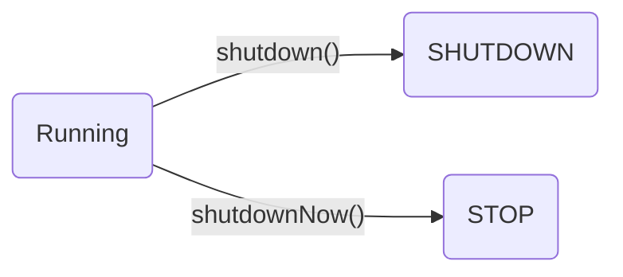

# 序言

为什么需要线程池？

在实际使用中，线程是很占用系统资源的，如果对线程管理不善很容易导致系统问题。 
因此，在大多数并发框架中都会使用线程池来管理线程，使用线程池管理线程主要有如下好处：
1. 使用线程池可以重复利用已有的线程继续执行任务，避免线程在创建和销毁时造成的消耗。
2. 由于没有线程创建和销毁时的消耗，可以提高系统响应速度。
3. 通过线程可以对线程进行合理的管理，根据系统的承受能力调整可运行线程数量的大小等。

# 工作原理

线程池执行所提交的任务过程：
1. 先判断线程池中核心线程池所有的线程是否都在执行任务。如果不是，则新创建一个线程执行刚提交的任务，否则，核心线程池中所有的线程都在执行任务，则进入第2步；
2. 判断当前阻塞队列是否已满，如果未满，则将提交的任务放置在阻塞队列中；否则，则进入第3步；
3. 判断线程池中所有的线程是否都在执行任务，如果没有，则创建一个新的线程来执行任务，否则，则交给饱和策略进行处理

# 线程池的分类

newCachedThreadPool

无限大小，短期

FixedThreadPool

固定大小

SingleThreadExecutor

线程池的生命周期
线程池的生命周期

B1 ----> C[(TIDYING)]
B2 ----> C
C ----> D[(TERMINATED)]

线程池的生命周期
.RUNNING ：能接受新提交的任务，并且也能处理阻塞队列中的任务；
.SHUTDOWN：关闭状态，不再接受新提交的任务，但却可以继续处理阻塞队列中已保存的任务。
.STOP：不能接受新任务，也不处理队列中的任务，会中断正在处理任务的线程。
.TIDYING：如果所有的任务都已终止了，workerCount (有效线程数) 为0，线程池进入该状态后会调用terminated() 方法进入TERMINATED 状态。
.TERMINATED：在terminated() 方法执行完后进入该状态，默认terminated()方法中什么也没有做。

线程池的创建
注意：一定要掌握各个参数的具体含义

参数说明
.corePoolSize：核心线程池的大小
.maximumPoolSize：线程池能创建线程的最大个数
.keepAliveTime：空闲线程存活时间
.unit：时间单位，为keepAliveTime指定时间单位
.workQueue：阻塞队列，用于保存任务的阻塞队列
.threadFactory：创建线程的工程类
.handler：饱和策略（拒绝策略）

阻塞队列
.ArrayBlockingQueue
.LinkedBlockingQueue
.DelayQueue
.PriorityBlockingQueue
.SynchronousQueue

拒绝策略
.ThreadPoolExecutor.AbortPolicy:丢弃任务并抛出RejectedExecutionException异常。
.ThreadPoolExecutor.DiscardPolicy：也是丢弃任务，但是不抛出异常。
.ThreadPoolExecutor.DiscardOldestPolicy：丢弃队列最前面的任务，然后重新尝试执行任务（重复此过程）
.ThreadPoolExecutor.CallerRunsPolicy：由调用线程处理该任务

execute方法执行逻辑

execute方法执行逻辑
.如果当前运行的线程少于corePoolSize，则会创建新的线程来执行新的任务；
.如果运行的线程个数等于或者大于corePoolSize，则会将提交的任务存放到阻塞队列workQueue中；
.如果当前workQueue队列已满的话，则会创建新的线程来执行任务；
.如果线程个数已经超过了maximumPoolSize，则会使用饱和策略RejectedExecutionHandler来进行处理。

Executor和Submit
.submit是基方法Executor.execute(Runnable)的延伸，通过创建并返回一个Future类对象可用于取消执行和/或等待完成。

线程池的关闭
.关闭线程池，可以通过shutdown和shutdownNow两个方法
.原理：遍历线程池中的所有线程，然后依次中断
.1、shutdownNow首先将线程池的状态设置为STOP,然后尝试停止所有的正在执行和未执行任务的线程，并返回等待执行任务的列表；
.2、shutdown只是将线程池的状态设置为SHUTDOWN状态，然后中断所有没有正在执行任务的线程
